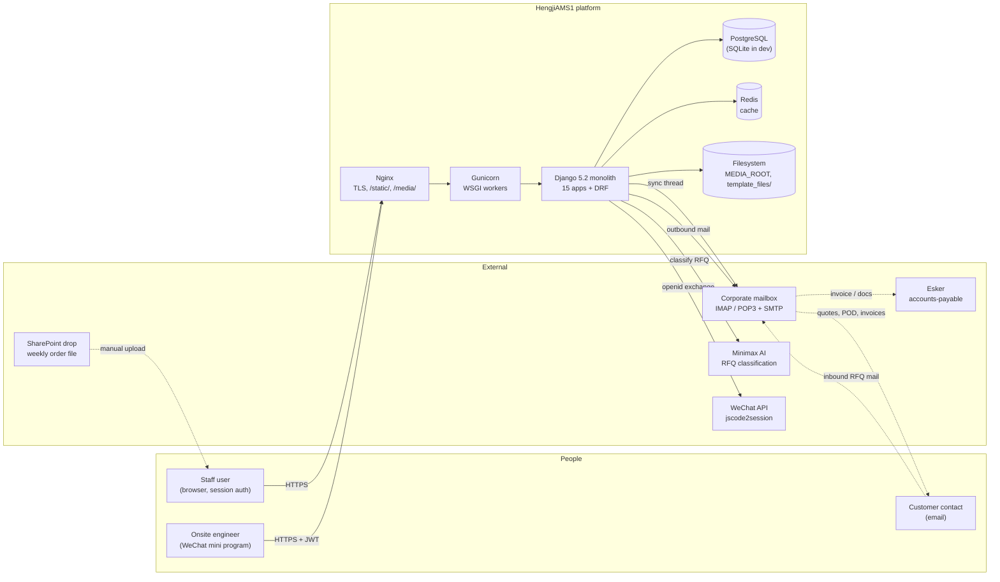
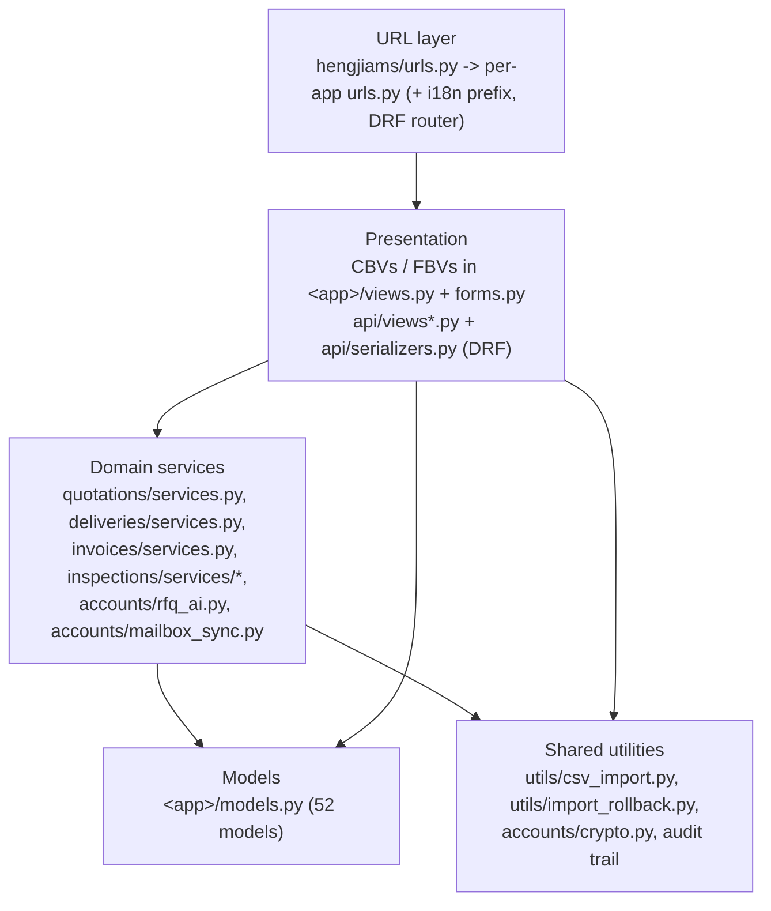
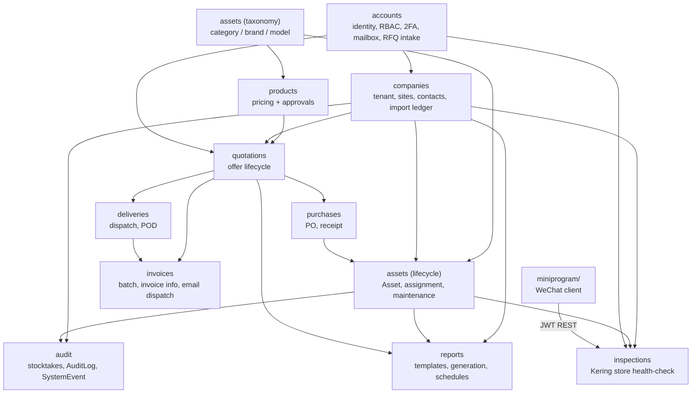
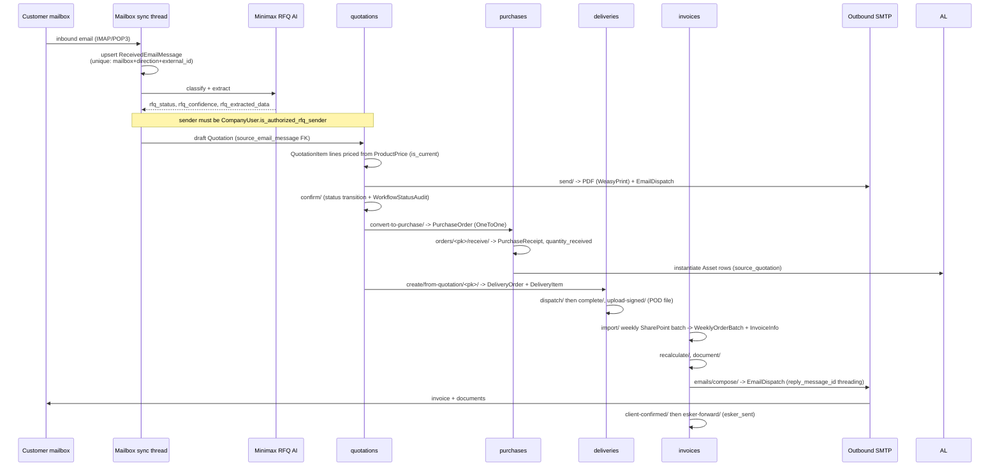
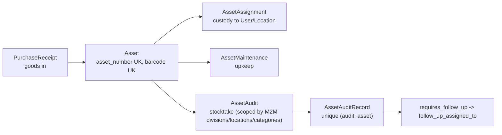
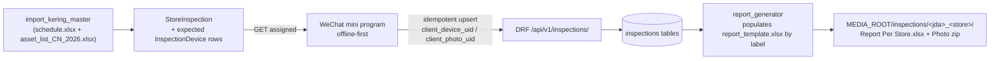
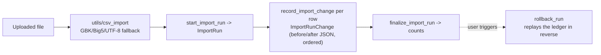

# System Architecture - HengJi AMS

**Purpose:** the single high-level view of how HengJi AMS fits together — external actors and
systems, the bounded contexts and their dependencies, and the end-to-end data flows. Individual
decisions live in [`ARCHITECTURAL_DECISION_RECORDS.md`](ARCHITECTURAL_DECISION_RECORDS.md);
routes in [`WEB_ROUTES.md`](WEB_ROUTES.md); tables in
[`DATABASE_SCHEMA.md`](DATABASE_SCHEMA.md).

**Basis:** derived from the live codebase — `INSTALLED_APPS`, the FK/M2M graph across all 52
models, the resolved URL table (490 routes) and `settings.py`. Not aspirational.

---

## 1. System context

Notes:

- **One deployable.** A Django monolith behind Nginx/Gunicorn. There is no service mesh, no
  queue broker and no async worker pool.
- **Mailbox is per-user, not system-wide.** Each staff member's `UserMailboxSettings` holds
  Fernet-encrypted IMAP/SMTP credentials; sync runs as an **in-process background thread**
  (`accounts/mailbox_sync.py`, ≈5-minute cadence) over mailboxes with
  `is_active AND auto_sync_enabled`. `SystemSMTPSettings` (singleton row) is the fallback sender.
  See the multi-worker caveat in [`DEPLOYMENT.md`](DEPLOYMENT.md) §Step 10.
- **SharePoint is a human-in-the-loop drop.** The weekly order file is uploaded through
  `invoices/import/`, not pulled by an integration.
- **Esker is downstream of email.** `EmailDispatch.esker_sent` records the hand-off; there is no
  Esker API client.
- **The mini program is a second client of the same monolith**, authenticated with SimpleJWT
  rather than sessions, and scoped by the `inspection_engineer` role.

---

## 2. Layering inside the monolith

Conventions worth knowing before editing:

- **Apps own their models; `utils/` owns cross-app mechanics.** CSV parsing with encoding
  fallback (`utils/csv_import`) and the snapshot/rollback ledger (`utils/import_rollback`) are
  shared by the `assets`, `companies` and `inspections` importers.
- **Document generation lives in `<app>/services.py`** and reads Excel/OFD templates from the
  gitignored `template_files/` directory — generation raises `FileNotFoundError` without it
  ([`DEPLOYMENT.md`](DEPLOYMENT.md) §Step 4b). PDF rendering is WeasyPrint, deliberately without
  LibreOffice (ADR-0008).
- **`audit.AuditLog` is the one cross-cutting write target.** Apps record actions through its
  generic FK (`content_type` + `object_id`) instead of adding per-app trail tables; field-level
  diffs hang off it via `audit.ChangeLog`.
- **Model-free apps are real apps.** `customers`, `dashboard`, `mobile`, `users` and `utils`
  contribute views, templates and helpers with no tables.

---

## 3. Bounded contexts and dependencies

Read the arrows as "depends on". Two things follow:

- **`quotations` is the order-to-cash hub.** `purchases`, `deliveries`, `invoices` and even
  `assets.Asset.source_quotation` all point back at a `Quotation`; `PurchaseOrder` is OneToOne
  with it. Changing the quotation model has the widest blast radius in the system.
- **`companies` and `accounts` are the roots.** Almost every context FKs into `Company`
  (and usually `Division` / `Location`) and into `User`. `inspections` deliberately reuses these
  roots rather than inventing a parallel tenant model, but keeps its Kering-specific attributes
  on its own models so `assets.Asset` stays generic (ADR-0011).

---

## 4. Primary flow: RFQ email → cash

**State is recorded three ways**, which is intentional: the domain `status` CharField on each
document, `invoices.WorkflowStatusAudit` (FK-free `entity_type` + `entity_id`, so one table
covers quotations/deliveries/invoices), and `audit.AuditLog` for the actor/IP/metadata trail.

---

## 5. Secondary flows

### 5.1 Asset lifecycle & physical audit

Auditors work the `audit/**` screens (gated by `can_view_audit` / `can_create_audit`, with
object-level `can_edit_audit(obj)`); barcode capture happens on web (`m/scan/`) and in the mini
program (`wx.scanCode`).

### 5.2 Kering store inspection (mini program)

This flow **replaces a Feishu questionnaire** and reproduces the legacy EUS deliverable byte-for-label
(ADR-0011). Offline resilience is schema-enforced: the two unique constraints on
`(store_inspection, client_device_uid)` and `(store_inspection, client_photo_uid)` make a
re-synced mutation queue idempotent, so a flaky store network cannot duplicate readings.
Deployment specifics: [`DEPLOYMENT_MINIPROGRAM.md`](DEPLOYMENT_MINIPROGRAM.md).

### 5.3 Bulk import with rollback

Every CSV/XLSX importer (`assets`, `companies` ×3, `inspections`) follows one shape:

This is why each import screen has a sibling `…/rollback/` route, and why the Kering importer
could be validated against 126 real stores and then safely reversed (ADR-0006).

---

## 6. Cross-cutting concerns

| Concern | Mechanism |
|---|---|
| Authentication | Django sessions (web) · SimpleJWT access/refresh (mini program) · WeChat `jscode2session` openid binding via `accounts.WeChatIdentity` (`session_key` never persisted) |
| Authorization | Capability methods on `User` (`can_manage_users`, `can_manage_orders`, `can_manage_companies`, `can_view/create/edit_audit`, `can_run_inspection`) consumed by `UserPassesTestMixin` in views and by DRF permission classes in the API. Scope limiting via `managed_company` / `managed_divisions` / `managed_locations` |
| MFA | `django-otp` TOTP + static backup tokens; `User.two_factor_enabled`, `force_2fa_setup`, `backup_tokens` |
| Secrets at rest | Fernet (`DJANGO_FIELD_ENCRYPTION_KEY`) over mailbox/SMTP passwords — `accounts/crypto.py` |
| Auditability | `AuditLog` (generic FK) + `ChangeLog` (field diffs) + `SystemEvent` (severity-graded ops log) + `LoginAttempt` / `UserSession` |
| i18n | `i18n_patterns` locale prefix (`en-us`, `zh-cn`), `.po`/`.mo` under `locale/`, `User.language_preference` |
| Caching | `django-redis` when `DJANGO_REDIS_CACHE_URL` is set; local-memory cache in dev |
| Static/media | WhiteNoise `CompressedManifestStaticFilesStorage` in production; Nginx serves `/static/` and `/media/` |
| Documents | openpyxl for Excel, WeasyPrint for PDF (no LibreOffice — ADR-0008), templates from gitignored `template_files/` |
| Fail-fast config | `settings.py` raises `ImproperlyConfigured` when `DEBUG=False` and `SECRET_KEY` is the dev fallback, or `DJANGO_FIELD_ENCRYPTION_KEY` / `WECHAT_MINI_APPID` / `WECHAT_MINI_APPSECRET` are missing |
| CI | `.github/workflows/backend-ci.yml` (Django checks + tests) and `miniprogram-ci.yml` (eslint + optional `miniprogram-ci` preview) |

---

## 7. Runtime topology

| | Development | Production |
|---|---|---|
| Web server | `manage.py runserver` | Nginx → Gunicorn (4 workers, systemd) |
| Database | SQLite (`db.sqlite3`) | PostgreSQL 14+ |
| Cache | local memory | Redis 6+ |
| Static | Django `staticfiles` | WhiteNoise manifest + Nginx |
| Media | Django `serve` view | Nginx `alias` |
| TLS | none | Let's Encrypt via certbot |
| Mailbox sync | in-process thread | single dedicated process (avoid per-worker duplication) |
| Mini program | WeChat DevTools, "不校验合法域名" | released build against an ICP-filed HTTPS domain on the legal-domain whitelist |

---

## 8. Decision index

| ADR | Decision | Touches |
|---|---|---|
| ADR-0001 | Service catalog separation (hardware vs services) | `products`, `assets` taxonomy |
| ADR-0002 | Mailbox-driven RFQ automation | `accounts`, `quotations`, Minimax |
| ADR-0003 | Direct-dispatch fulfilment | `deliveries` |
| ADR-0004 | Hardware-only assets boundary | `assets` |
| ADR-0005 | Product price lifecycle (`is_current` + uniqueness) | `products` |
| ADR-0006 | Import rollback system | `utils/import_rollback`, `companies.ImportRun` |
| ADR-0007 | Multi-role administrator access control | `accounts.AdminRole`, capability methods |
| ADR-0008 | HTML→PDF without LibreOffice (WeasyPrint) | document services |
| ADR-0009 | Warehouse slot tracking | `assets`, `companies.Location` |
| ADR-0010 | Company contact vs company user split | `companies.CompanyUser` |
| ADR-0011 | WeChat mini program for Kering store inspection | `inspections`, `api`, `miniprogram/` |

---

## 9. Related documents

- [`WEB_ROUTES.md`](WEB_ROUTES.md) — every HTML route, view and required capability
- [`DATABASE_SCHEMA.md`](DATABASE_SCHEMA.md) — ER diagrams, PK strategy, unique business keys
- [`API_GUIDE.md`](API_GUIDE.md) — REST surface and JWT flow
- [`MINIPROGRAM_SPEC.md`](MINIPROGRAM_SPEC.md) — mini program contract
- [`WORKFLOW_GUIDE.md`](WORKFLOW_GUIDE.md) — business-level narratives
- [`DEPLOYMENT.md`](DEPLOYMENT.md) / [`DEPLOYMENT_MINIPROGRAM.md`](DEPLOYMENT_MINIPROGRAM.md) — runtime provisioning
- [`SECURITY.md`](SECURITY.md) · [`BACKUP_RESTORE.md`](BACKUP_RESTORE.md) · [`RELEASE_PROCEDURE.md`](RELEASE_PROCEDURE.md)

---

*Last Updated: September 15, 2026*
