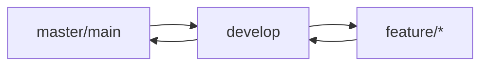

# Contributing to HengJi AMS

Thank you for your interest in contributing! This guide outlines how to contribute effectively to the HengJi Asset Management System.

## 📋 Table of Contents

- [Code of Conduct](#code-of-conduct)
- [Getting Started](#getting-started)
- [Development Workflow](#development-workflow)
- [Coding Standards](#coding-standards)
- [Commit Message Guidelines](#commit-message-guidelines)
- [Pull Request Process](#pull-request-process)
- [Testing Requirements](#testing-requirements)
- [Documentation](#documentation)

---

## Code of Conduct

### Our Standards

We strive to create a welcoming, inclusive environment. Examples of community standards:

**Positive:**
- Use welcoming and inclusive language
- Respect differing viewpoints and experiences
- Gracefully accept constructive criticism
- Focus on what's best for the community
- Be collaborative and transparent

**Unacceptable:**
- Harassment, discrimination, or trolling
- Personal attacks or inappropriate comments
- Publishing private information without consent
- Other unethical or unprofessional conduct

## Getting Started

### 1. Setup Environment

```bash
# Activate Conda environment (if using)
conda activate HengjiAMS1

# Clone repository
git clone https://github.com/your-org/hengji-ams.git
cd hengji-ams

# Install dependencies
pip install -r requirements.txt

# Run migrations
python manage.py migrate

# Start development server
python manage.py runserver
```

### 2. Find an Issue

- Check existing [GitHub Issues](https://github.com/your-org/hengji-ams/issues)
- Look for `good first issue` labels for beginner-friendly tasks
- Comment to express interest (avoid "I'll work on this" spam)

### 3. Create Your Branch

```bash
git checkout -b feature/descriptive-name
# or
git checkout -b fix/descriptive-bug-fix
```

Use prefixes:
- `feature/` - New functionality
- `fix/` - Bug fixes
- `docs/` - Documentation updates
- `refactor/` - Code restructuring (no behavior change)
- `test/` - Tests
- `chore/` - Build/process updates

---

## Development Workflow

### Branch Strategy



- **main/master**: Production-ready releases
- **develop**: Integration branch (future releases)
- **feature/\***: Individual features from develop

### Making Changes

1. **Understand the Codebase**
   - Read related code before modifying
   - Check existing patterns in similar modules
   - Review ADRs for architectural context

2. **Create Tests**
   - Unit tests for new logic
   - Integration tests for workflows
   - Coverage ≥ 80% for new code

3. **Write Code**
   - Follow style guide (below)
   - Add docstrings/comments where needed
   - Keep functions focused and small (<50 lines when possible)

4. **Test Locally**
   ```bash
   # Run Django system checks
   python manage.py check
   
   # Run relevant tests
   python manage.py test <app_name>.tests
   
   # Full test suite
   python manage.py test
   ```

5. **Verify No Breaking Changes**
   ```bash
   # Ensure no new migrations introduced unexpectedly
   python manage.py makemigrations --check
   
   # Lint/format check if applicable
   flake8 .
   black . --check
   ```

---

## Coding Standards

### General Principles

1. **Python Style Guide**: Follow PEP 8
   - Line length: max 79 chars (72 for long strings/URLs)
   - Indentation: 4 spaces per level
   - Blank lines: 2 for functions/classes, 1 for within methods

2. **Django Conventions**
   - Models defined in `models.py`
   - Views separated by type (`views.py`, `api_views.py`)
   - Use class-based views (CBVs) preferred over function-based
   - Context names should be explicit: `get_context_data()` override

3. **Naming Conventions**

| Type | Convention | Example |
|------|------------|---------|
| Class names | PascalCase | `AssetListView` |
| Function/method | snake_case | `calculate_total_price()` |
| Constants | UPPER_SNAKE_CASE | `MAX_ITEMS_PER_PAGE = 50` |
| Private methods | `_leading_underscore` | `_validate_input()` |

4. **Type Hints** (Preferred)
```python
from typing import Optional, List, Dict, Any

def get_asset(
    asset_id: UUID,
    user: User
) -> Optional[Asset]:
    """Fetch asset accessible to user."""
    ...
```

### Templates

1. **Structure**: Semantic HTML5 with Bootstrap 5 classes
2. **Internationalization**: Wrap all user-visible strings with `` or ``
3. **Comments**: Remove debug comments before commit (`<!-- DEBUG: -->` blocks removed)
4. **Extends**: Use `` consistently

### Database Models

```python
class MyModel(models.Model):
    created_at = models.DateTimeField(auto_now_add=True)  # Always add timestamps
    updated_at = models.DateTimeField(auto_now=True)
    
    # Choices as tuples or Enum-like dicts
    STATUS_CHOICES = [
        ('active', 'Active'),
        ('inactive', 'Inactive'),
    ]
    status = models.CharField(max_length=20, choices=STATUS_CHOICES, default='active')
    
    # Foreign keys with cascade rules explicit
    owner = models.ForeignKey(User, on_delete=models.CASCADE, related_name='my_models')
```

### Error Handling

```python
# Prefer try/except at appropriate boundary
try:
    result = expensive_operation()
except SpecificError as e:
    logger.error(f"Operation failed: {e}")
    messages.error(request, "Sorry, that didn't work.")
    return redirect('some_view')
```

Avoid bare `except:` clauses. Catch specific exceptions.

---

## Commit Message Guidelines

Follow [Conventional Commits](https://www.conventionalcommits.org/) format:

### Format

```
<type>(<scope>): <subject>

[optional body]

[optional footer: BREAKING CHANGE description or Fixes #issue]
```

### Types

| Type | When to use |
|------|-------------|
| `feat:` | New feature |
| `fix:` | Bug fix |
| `docs:` | Documentation only changes |
| `style:` | Formatting, missing semicolons, etc. (no code meaning) |
| `refactor:` | Code change that neither fixes bug nor adds feature |
| `perf:` | Performance improvement |
| `test:` | Adding/updating tests |
| `chore:` | Build process/auxiliary tool changes |

### Subject Rules

- Imperative mood ("Add feature", not "Added feature")
- Capitalize first letter
- No period at end
- Max 72 characters

### Examples

```bash
# Good
feat(assets): add batch delete operation for multiple assets
fix(quotation): resolve pricing calculation on service items
docs(contributing): update testing guidelines in CONTRIBUTING.md

# Bad
updated stuff
Fixes #123
WIP
```

### Scope Guidelines

Use scopes matching app names:
- `accounts`, `assets`, `companies`, `products`, `quotations`, `deliveries`, `invoices`, `dashboard`, `reports`

---

## Pull Request Process

### Before Submitting

1. **Sync with main**: 
   ```bash
   git fetch origin
   git rebase origin/main
   ```

2. **Resolve conflicts** (if any)

3. **Final verification**:
   ```bash
   python manage.py check
   python manage.py test <changed_app>.tests
   flake8 .
   ```

4. **Draft PR for feedback** (use `[WIP]` prefix while working)

### Creating PR

1. **Title Format**: Same convention as commit messages
   ```
   feat(companies): add location zone/rack/shelf support
   ```

2. **Description Template** (fill out provided template):

```markdown
## What does this PR do?
Brief summary of the change

## How should this be tested?
Steps to verify functionality

## Screenshots (if UI changes)
[Attach images/videos]

## Checklist
- [ ] Self-reviewed my own code
- [ ] Commented my code, particularly in hard-to-understand areas
- [ ] Made corresponding changes to documentation (README, ADRs, etc.)
- [ ] Added tests proving my fix is effective or feature works
- [ ] Ran tests and confirmed passing
- [ ] Generated no new lint warnings
- [ ] Changed/added migrations appropriately
- [ ] Rebased onto/up-to-date with base branch
```

### Review Process

1. **Maintainer triage** within 48 hours
2. **At least 1 approval** required for merge
3. CI must pass (tests, lint checks)
4. Address review comments iteratively
5. Maintain single commit history (squash merge preferred)

---

## Testing Requirements

### Test Categories

1. **Unit Tests**: Single function/method in isolation
2. **Integration Tests**: Multiple components working together
3. **End-to-End (E2E)**: Browser automation (Playwright for critical paths)

### Writing Effective Tests

```python
from django.test import TestCase
from django.contrib.auth import get_user_model
from assets.models import Asset

User = get_user_model()

class AssetListViewTest(TestCase):
    def setUp(self):
        self.user = User.objects.create_user(username='test', password='pass')
        self.asset = Asset.objects.create(
            category=category_obj,
            brand=brand_obj,
            manufacturer='Test Brand',
            serial_number='SN123'
        )
    
    def test_list_shows_assets_accessible_to_user(self):
        self.client.force_login(self.user)
        response = self.client.get(reverse('assets:list'))
        self.assertEqual(response.status_code, 200)
        self.assertContains(response, 'SN123')
```

### Running Tests

```bash
# All tests
python manage.py test

# Specific app
python manage.py test assets

# Specific test method
python manage.py test assets.tests.AssetListViewTest.test_list_shows_assets

# With coverage
coverage run manage.py test
coverage report -m
```

### Critical Paths to Test

- ✅ Authentication flow (login, logout, 2FA)
- ✅ Quotation → Purchase → Delivery → Invoice workflow
- ✅ Asset import/export CSV/Excel/PDF
- ✅ Mailbox sync and RFQ classification
- ✅ Role-based access control (Superadmin, IT Admin, Order Management)
- ✅ Multi-language switching (EN/ZH)

---

## Documentation

### Where to Update Documentation

When making changes, ensure corresponding docs are updated:

| Change Type | Required Documentation Updates |
|-------------|-------------------------------|
| New feature | README, API docs (if applicable), ADRs |
| API changes | API reference, SDK examples |
| Model changes | ADRs, ER diagrams, migrations guide |
| Configuration | `.env.example`, deployment docs |
| UI changes | User guides, screenshot updates |
| Bug fixes | CHANGELOG.md, release notes |

### Documentation Structure

```
docs/
├── ARCHITECTURAL_DECISION_RECORDS.md  # ADRs (MANDATORY for architectural changes)
├── API_GUIDE.md                        # REST API documentation
├── DEPLOYMENT.md                       # Production deployment guide
├── DATABASE_SCHEMA.md                  # Data model documentation
├── WORKFLOW_GUIDE.md                   # Operational procedures
├── CONTRIBUTING.md                     # This file
├── RELEASE_NOTES.md                    # Detailed release changelogs
└── tbd/                               # Future topics
```

### Writing Good Docs

1. **Examples**: Include code snippets/configurations users can copy-paste
2. **Screenshots**: Visual aids for complex flows
3. **Version Pinning**: Reference specific versions when mentioning commands
4. **Clarity First**: Prioritize clarity over completeness; iterate later

---

## Community Channels

- **[GitHub Discussions]**: General Q&A and proposals
- **[Project Board]](https://github.com/orgs/your-org/projects/1): Workflow tracking
- **[Issues]**: Bug reports and feature requests
- **Email**: [contact@hengji.com](mailto:contact@hengji.com) (for sensitive matters)

---

## Recognition

Contributors are recognized in:
- CHANGELOG.md (with permission)
- GitHub contributors list
- Release notes highlights
- Monthly team meetings

---

## Questions or Needs Help?

Reach out via:
1. GitHub Issue (tagged `question` or `help wanted`)
2. Email maintainers directly
3. Community channel during office hours

---

*Last Updated: August 20, 2026*  
*Authors: Sean Liu and Contributors*
