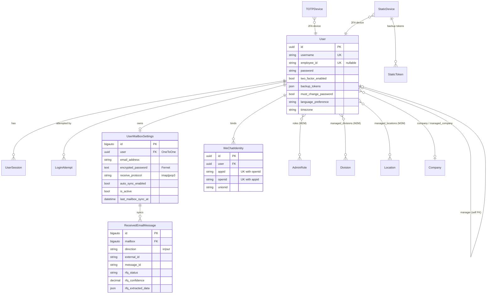
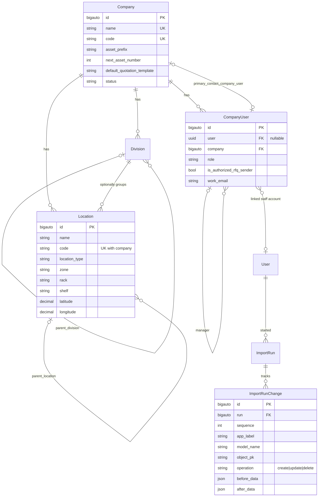
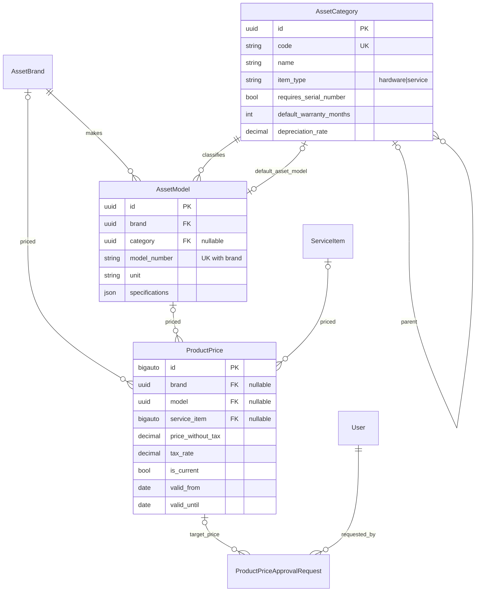
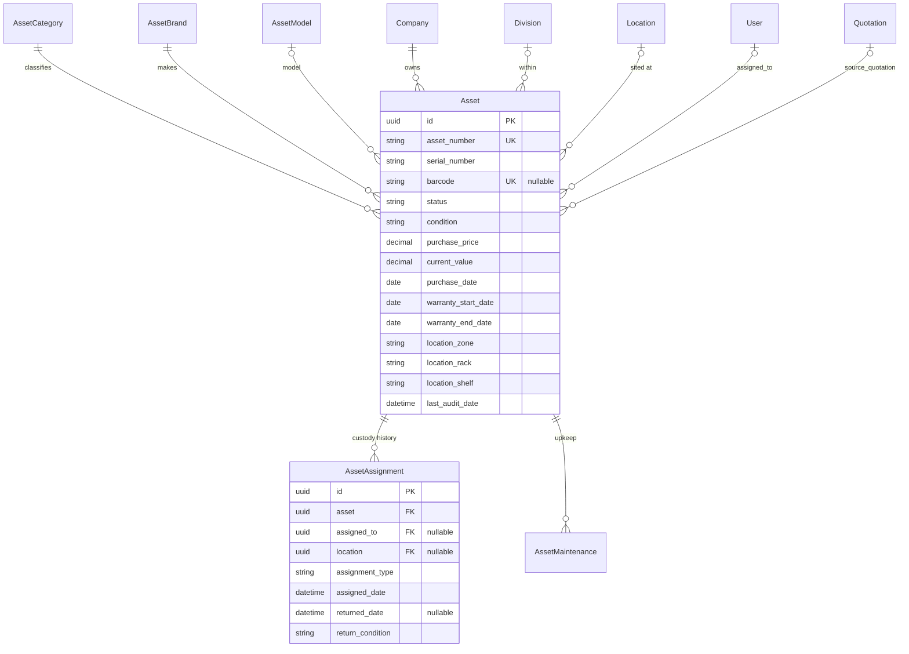
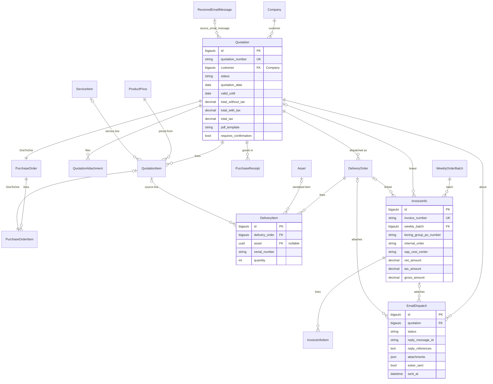
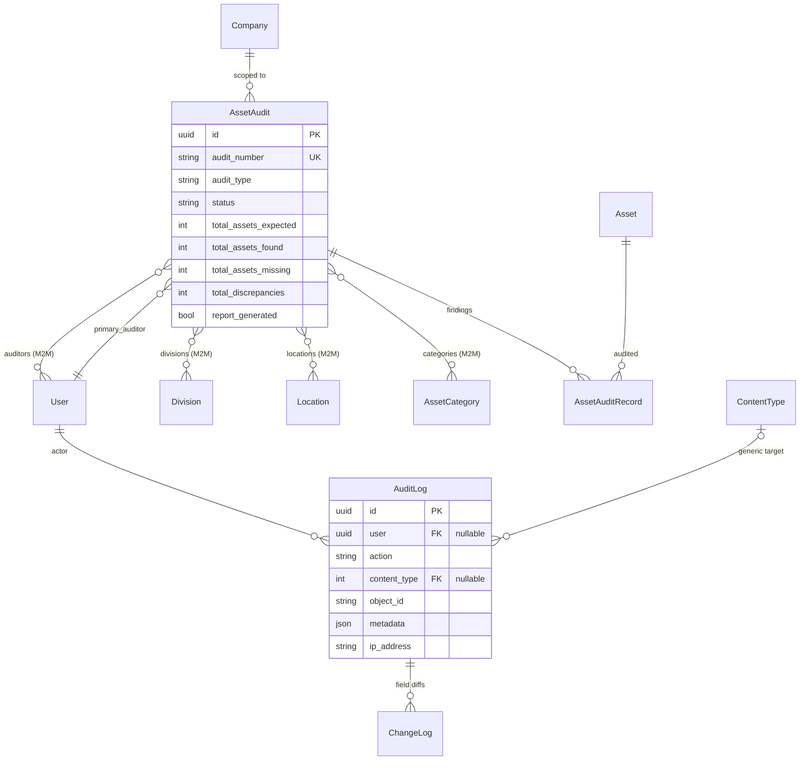
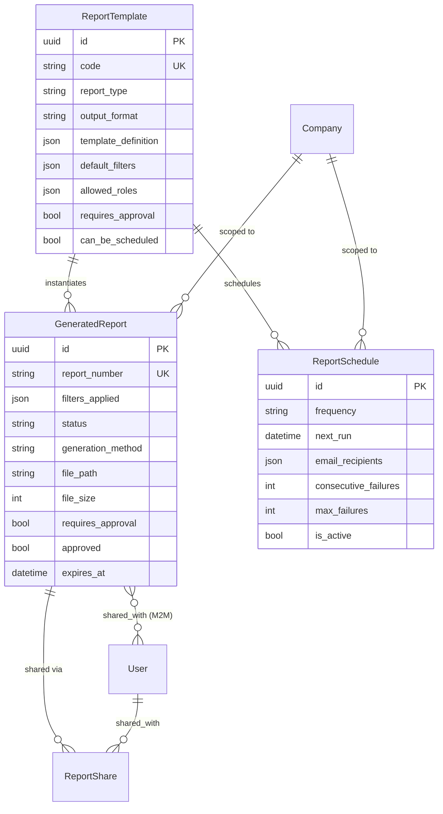
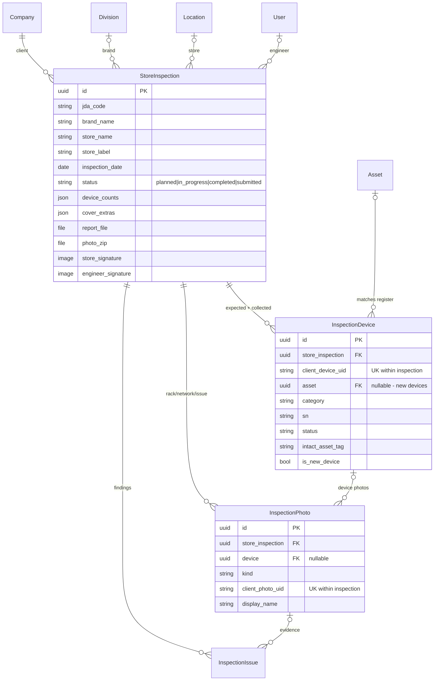

# Database Schema Reference - HengJi AMS

**Scope:** all 52 persisted models across 11 first-party Django apps (plus `django-otp` tables).
**Generated from:** the live Django app registry (`apps.get_models()` + `_meta`), then curated — so
every field, relation, primary-key type and constraint below reflects the code, not a guess.
**Companion docs:** [`DATABASE_MIGRATION.md`](DATABASE_MIGRATION.md) (SQLite → PostgreSQL),
[`ARCHITECTURE.md`](ARCHITECTURE.md) (bounded contexts and data flow).

---

## 1. Conventions

### Primary-key strategy (mixed, by design and by history)

| Strategy | Apps / models | Notes |
|---|---|---|
| `UUIDField` PK | `accounts.User`, `accounts.LoginAttempt`, `accounts.UserSession`, `accounts.WeChatIdentity`, **all** `assets.*`, **all** `audit.*`, **all** `inspections.*`, **all** `reports.*`, `purchases.PurchaseReceipt` | UUID4 default; safe to expose in URLs, no cross-DB sequence concerns |
| `BigAutoField` PK | **all** `companies.*`, `quotations.*`, `deliveries.*`, `invoices.*`, `products.*`, `purchases.PurchaseOrder`/`PurchaseOrderItem`, `accounts.AdminRole`, `accounts.ReceivedEmailMessage`, `accounts.UserMailboxSettings` | Sequential 64-bit ids |
| `AutoField` PK | `otp_totp.TOTPDevice`, `otp_static.StaticDevice`, `otp_static.StaticToken` | Third-party (`django-otp`) — do not change |
| Singleton | `accounts.SystemSMTPSettings` (`PositiveSmallIntegerField` PK, fixed id `1`) | One row system-wide |

> ⚠️ **Migration impact:** the mixed strategy matters for SQLite → PostgreSQL. BigAutoField
> sequences must be reset after a `loaddata` (see `DATABASE_MIGRATION.md`); UUID tables need none.

### Shared field patterns

- **Timestamps:** nearly every first-party model carries `created_at` / `updated_at`
  (`auto_now_add` / `auto_now`). Exceptions are event-style tables that use a single
  domain timestamp instead (`LoginAttempt.timestamp`, `AuditLog.timestamp`,
  `SystemEvent.timestamp`, `AssetAssignment.assigned_date`, `InvoiceInfoItem`).
- **Status as `CharField` + choices:** no enum columns. State machines live in Python
  (`TextChoices`) and are persisted as short strings — `Asset.status`, `Quotation.status`,
  `DeliveryOrder.status`, `PurchaseOrder.status`, `StoreInspection.status`, `EmailDispatch.status`.
- **Encrypted secrets:** credential fields are stored as `encrypted_password: TextField`
  (Fernet, key from `DJANGO_FIELD_ENCRYPTION_KEY`) — `UserMailboxSettings`,
  `SystemSMTPSettings`. Never plaintext. See `accounts/crypto.py` and [`SECURITY.md`](SECURITY.md).
- **JSON escape hatches:** `JSONField` holds heterogeneous or evolving data —
  `AssetModel.specifications`, `ProductPriceApprovalRequest.current_snapshot`/`proposed_snapshot`,
  `AuditLog.metadata`, `SystemEvent.metadata`, `EmailDispatch.attachments`,
  `StoreInspection.device_counts`/`cover_extras`, `ReportTemplate.template_definition`.
- **Generic relations:** only `audit.AuditLog` uses `content_type` + `object_id`
  (`GenericForeignKey content_object`), letting one table log actions against any model.
- **Money:** `DecimalField` everywhere for prices/tax/totals — never `FloatField`.

---

## 2. Bounded contexts

| Context | App | Models | Responsibility |
|---|---|---|---|
| Identity & access | `accounts` | User, AdminRole, UserSession, LoginAttempt, WeChatIdentity, UserMailboxSettings, SystemSMTPSettings, ReceivedEmailMessage | Authentication, RBAC, 2FA, per-user mailboxes, inbound email + RFQ triage |
| 2FA (vendor) | `otp_totp`, `otp_static` | TOTPDevice, StaticDevice, StaticToken | `django-otp` device/token storage |
| Organization | `companies` | Company, Division, Location, CompanyUser, ImportRun, ImportRunChange | Tenant hierarchy, site structure, customer contacts, import rollback ledger |
| Catalog | `assets` (taxonomy), `products` (pricing) | AssetCategory, AssetBrand, AssetModel, ProductPrice, ServiceItem, ProductPriceApprovalRequest | What can be quoted/owned, and at what price |
| Asset lifecycle | `assets` | Asset, AssetAssignment, AssetMaintenance | Physical devices, custody, upkeep |
| Sales | `quotations` | Quotation, QuotationItem, QuotationAttachment | Offer lifecycle from RFQ to confirmation |
| Procurement | `purchases` | PurchaseOrder, PurchaseOrderItem, PurchaseReceipt | Buying against a confirmed quotation |
| Fulfilment | `deliveries` | DeliveryOrder, DeliveryItem | Dispatch and signed receipt |
| Billing | `invoices` | WeeklyOrderBatch, InvoiceInfo, InvoiceInfoItem, EmailDispatch, WorkflowStatusAudit | SharePoint batch import, invoice lines, outbound email lifecycle |
| Audit | `audit` | AssetAudit, AssetAuditRecord, AuditLog, ChangeLog, SystemEvent | Physical stocktakes plus system-wide action/field/system logging |
| Reporting | `reports` | ReportTemplate, GeneratedReport, ReportSchedule, ReportShare | Template-driven report generation, scheduling, sharing |
| Store inspection | `inspections` | StoreInspection, InspectionDevice, InspectionPhoto, InspectionIssue | Kering EUS store health-check (WeChat mini program backend) |

`customers`, `dashboard`, `mobile`, `users` and `utils` are **model-free** apps: they contribute
views, URL routes and helpers only (see [`WEB_ROUTES.md`](WEB_ROUTES.md)).

---

## 3. ER diagrams

### 3.1 Identity & access (`accounts`)



**Constraints:** `uniq_mailbox_direction_external_message` (UniqueConstraint on
`ReceivedEmailMessage`) makes mailbox sync idempotent; `uniq_wechat_appid_openid`
prevents one WeChat openid binding to two staff users.

### 3.2 Organization (`companies`)



**Constraints:** `Location` `unique_together (company, code)`; `CompanyUser`
`unique_together (user, company)`. `ImportRun.rolled_back_at` + the ordered
`ImportRunChange` ledger are what make `utils/import_rollback.rollback_run` possible.

### 3.3 Catalog & pricing (`assets` taxonomy + `products`)



**Constraints (the interesting ones):**

- `productprice_single_catalog_target` (**CheckConstraint**) — a price row targets exactly one
  of `model` / `service_item`, enforcing the hardware-vs-service catalog split at the DB level.
- `uniq_current_product_price_per_model` and `uniq_current_product_price_per_service_item`
  (**UniqueConstraint**) — only one `is_current=True` price per catalog target, so "current
  price" lookups cannot return two rows. This is the backbone of price lifecycle management
  (ADR-0005): superseding a price clears `is_current` on the old row.
- `AssetModel.unique_together (brand, model_number)`; `AssetBrand.name`/`code` unique;
  `AssetCategory.code` unique.

> ⚠️ Because brand `code` is unique and derived from the name, case variants of the same
> brand (`HP` vs `hp`) collide. Importers must look up **by code, then by name**, and only
> create when neither matches (see `import_kering_master`).

### 3.4 Asset lifecycle (`assets`)



`Asset.asset_number` is the **business key** (unique, text — keep it out of scientific
notation on export). `Asset.barcode` is unique but nullable, backing the barcode-scan flows.
Warehouse slot detail is duplicated onto the asset (`location_zone`/`_rack`/`_shelf`) as well
as resolvable via `Location` (ADR-0009).

### 3.5 Order-to-cash spine (`quotations` → `purchases` → `deliveries` → `invoices`)



**Key facts for maintainers:**

- `Quotation` is the **hub**: `PurchaseOrder` (OneToOne), `PurchaseReceipt`, `DeliveryOrder`,
  `InvoiceInfo` and `EmailDispatch` all point back at it, and `Asset.source_quotation` closes
  the loop into the asset register.
- `PurchaseOrderItem.quotation_item` is **OneToOne** — a PO line maps to exactly one quotation
  line, which is what keeps `quantity_ordered` vs `quantity_received` reconcilable.
- `unique_asset_per_delivery_order` (UniqueConstraint on `DeliveryItem`) prevents the same
  serialised asset appearing twice on one delivery.
- `uniq_invoice_business_keys` (UniqueConstraint on `InvoiceInfo`) guards the SharePoint batch
  import against duplicate invoice rows; `WeeklyOrderBatch.failed_row_number` /
  `failure_reason` record where a batch stopped.
- `EmailDispatch.reply_message_id` / `reply_references` implement correct threading back into
  the customer's inbox; `esker_sent` tracks the downstream AP hand-off.
- `invoices.WorkflowStatusAudit` is deliberately **FK-free** (`entity_type` + `entity_id`
  strings) so one table can record status transitions for quotations, deliveries and invoices.

### 3.6 Audit (`audit`)



`AssetAuditRecord.unique_together (audit, asset)` — one finding per asset per audit.
`AuditLog` is the system-wide trail (generic FK); `ChangeLog` hangs field-level
old/new values off it; `SystemEvent` is a separate severity-graded operational log with a
`resolved` / `resolved_by` / `resolved_at` lifecycle.

> The Kering store inspection deliberately does **not** reuse `AssetAudit`/`AssetAuditRecord` —
> its data contract is richer, so it has its own context (ADR-0011). It does write `AuditLog`
> entries on signoff for traceability.

### 3.7 Reporting (`reports`)



`ReportShare.unique_together (report, shared_with)`; approval gating is
`requires_approval` → `approved` / `approved_by` / `approved_at` on `GeneratedReport`.

### 3.8 Store inspection (`inspections`)



**Idempotency is schema-enforced:** `uniq_inspection_device_uid`
(`store_inspection` + `client_device_uid`) and `uniq_inspection_photo_uid`
(`store_inspection` + `client_photo_uid`) are what let the offline-first mini program re-sync
a mutation queue without duplicating rows. `InspectionDevice.asset` is nullable on purpose —
an onsite-new device has no register entry yet.

---

## 4. Unique business keys (quick reference)

| Model | Unique key(s) |
|---|---|
| `Company` | `name`, `code` |
| `Location` | `(company, code)` |
| `CompanyUser` | `(user, company)` |
| `AssetBrand` | `name`, `code` |
| `AssetCategory` | `code` |
| `AssetModel` | `(brand, model_number)` |
| `Asset` | `asset_number`, `barcode` (nullable) |
| `User` | `username`, `employee_id` (nullable) |
| `WeChatIdentity` | `(appid, openid)` |
| `ReceivedEmailMessage` | `(mailbox, direction, external_id)` |
| `Quotation` | `quotation_number` |
| `PurchaseOrder` | `po_number` |
| `PurchaseReceipt` | `receipt_number` |
| `DeliveryOrder` | `delivery_number` |
| `InvoiceInfo` | `invoice_number`, `uniq_invoice_business_keys` |
| `WeeklyOrderBatch` | `batch_id` |
| `AssetAudit` | `audit_number` |
| `AssetAuditRecord` | `(audit, asset)` |
| `ReportTemplate` | `code` |
| `GeneratedReport` | `report_number` |
| `ReportShare` | `(report, shared_with)` |
| `DeliveryItem` | `unique_asset_per_delivery_order` |
| `InspectionDevice` | `(store_inspection, client_device_uid)` |
| `InspectionPhoto` | `(store_inspection, client_photo_uid)` |
| `ProductPrice` | one `is_current` per model; one `is_current` per service item |

---

## 5. Cross-context dependency notes

- `companies` is the root tenant context — `assets`, `quotations`, `audit`, `reports` and
  `inspections` all FK into `Company` (and usually `Division`/`Location`).
- `assets` taxonomy (`AssetCategory`/`AssetBrand`/`AssetModel`) is shared by `products`
  (pricing) and `purchases` (PO lines) — a change there ripples across quoting and buying.
- `accounts.ReceivedEmailMessage` is the entry point of the RFQ pipeline and is FK'd by both
  `quotations.Quotation` and `invoices.EmailDispatch`, tying inbound and outbound mail to the
  documents they produced (ADR-0002).
- `audit.AuditLog` is the only cross-cutting write target: nearly every app records to it via
  the generic FK rather than adding its own trail table.

---

## 6. Regenerating this document

The tables and diagrams were produced from the live app registry. To refresh after a model
change, dump the current schema and diff it against this file:

```python
# python manage.py shell
from django.apps import apps
for model in sorted(apps.get_models(), key=lambda m: (m._meta.app_label, m.__name__)):
    m = model._meta
    print(f"=== {m.app_label}.{model.__name__} pk={type(m.pk).__name__}")
    for f in m.get_fields():
        if getattr(f, 'auto_created', False):
            continue
        print("   ", f.name, type(f).__name__)
```

Then run `python manage.py makemigrations --check` — if it reports changes, this document and
the migrations are out of step.

---

*Last Updated: September 15, 2026*
