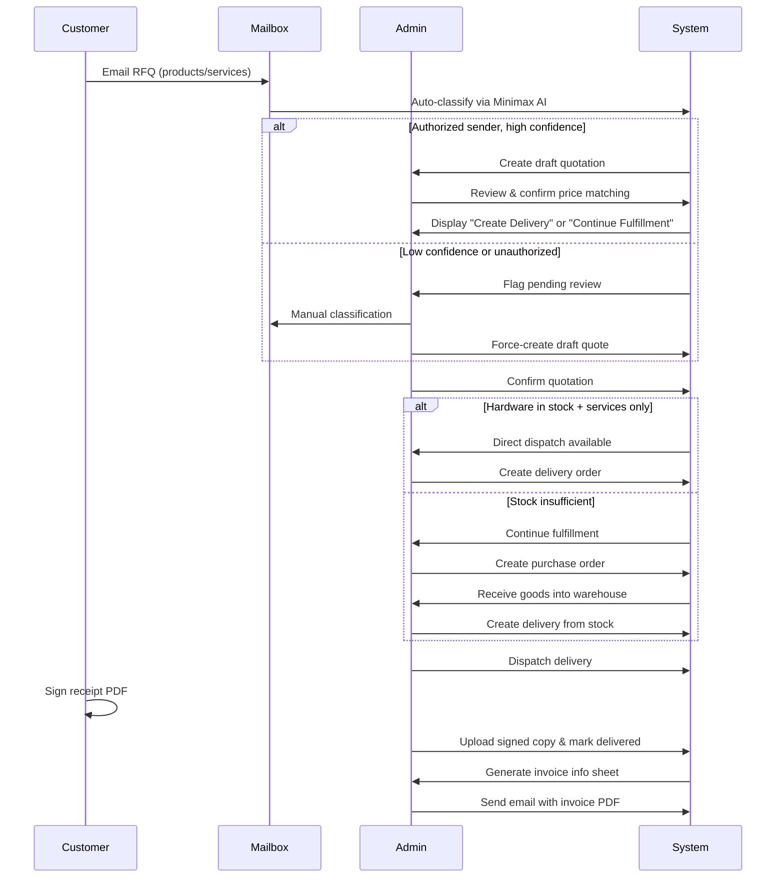

# Workflow Guide - HengJi AMS Operations

This guide provides operational procedures for using the HengJi AMS in daily business operations.

---

## Table of Contents

- [Order Management Workflow](#order-management-workflow)
- [Mailbox & RFQ Processing](#mailbox--rfq-processing)
- [Asset Import Procedures](#asset-import-procedures)
- [Invoice Processing Cycle](#invoice-processing-cycle)
- [Delivery Fulfillment](#delivery-fulfillment)
- [System Administration](#system-administration)

---

## Order Management Workflow

### End-to-End Flow



### Key Roles & Permissions

| Role | Access Level | Typical User Actions |
|------|--------------|---------------------|
| **Order Management Procurement Specialist** | Full access | Create/edit quotations, manage purchases, process deliveries, handle invoices |
| **IT Administrator** | Read-only order management | View quotes/deliveries, no creation permissions |
| **Superadmin** | All system | All actions + user/role management |
| **Viewer** | Asset view only | Cannot access order management |

---

## Mailbox & RFQ Processing

### Automatic RFQ Classification

**Trigger**: An in-process background thread syncs each active mailbox roughly every 5 minutes while the server runs. Auto-sync is **per mailbox** (`UserMailboxSettings.auto_sync_enabled`), not a global Django setting.

**Flow**:
1. IMAP/POP3 mailbox sync fetches new messages
2. Message parsing extracts email body content
3. Minimax API analyzes RFQ items and confidence scoring
4. Draft quotation created if confidence > 80% AND authorized sender
5. Pending task notifications added to dashboard

**Authorization Rules**:
- Only contacts flagged as `is_authorized_rfq_sender=true` qualify for auto-drafting
- Unauthorized senders require manual classification

### Manual Intervention Workflows

#### Reprocessing Messages
1. Navigate to **Accounts → Inbox**
2. Click message to open detail view
3. Select **"Reprocess"** button after corrections
4. Re-run AI classification manually

#### Linking Existing Quotation
1. Open message detail page
2. Click **"Link to Quotation"** dropdown
3. Search/select existing `QT-XXXXXX-XXX`
4. Update status tracking

#### Adding Comments
Use inline comments field on message detail for internal notes that aren't sent to customer.

---

## Asset Import Procedures

### CSV Import Template

1. Navigate to **Companies → Assets → Import**
2. Download sample CSV template
3. Fill data following column format:
   ```csv
   category_name,brand_name,model_name,serial_number,barcode,status,condition,location_name
   Laptop,Dell,XPS 15,SN123456,BC789,Available,New,Vanke VMO Warehouse
   Monitor,HP,Z34c,SN654321,BC012,Assigned,Used,Shanghai Office
   ```

### Validation Rules

| Field | Required | Format Example |
|-------|----------|----------------|
| category_name | ✅ Yes | Exactly matches DB name (case-sensitive) |
| brand_name | ✅ Yes | Must exist in catalog |
| model_name | ✅ Yes | Must match selected brand |
| serial_number | ❌ Optional | Any alphanumeric string |
| barcode | ❌ Optional | Unique per asset |
| status | ✅ Yes | Available/Assigned/Maintenance |
| condition | ✅ Yes | New/Good/Fair/Poor |
| location_name | ✅ Yes | Valid company location |

### Duplicate Handling

**Default behavior**: Skip duplicate serial numbers  
**Action required**: Edit incoming file or update database record first

**Update Mode**: For locations/contacts, checkbox enables "update matched entries instead of skipping"

### Import Result Monitoring

**Post-upload dashboard shows:**
- Total rows processed
- Successfully created count
- Updated vs skipped counts
- Error details (downloadable error report)

**Actions available**:
- ✅ Proceed with import (confirm upload)
- 🔙 Rollback latest import (if eligible)

---

## Invoice Processing Cycle

### Weekly Batch Import

Invoice records are created **only** by importing a weekly batch — there is no manual "create invoice" screen. Import is a **manual upload** (not a scheduled/automatic job).

**Route:** Invoices → Import (`/invoices/import/`, name `invoices:batch_import`)

**Steps**:
1. Obtain the customer's weekly order list as an **Excel** workbook (`.xlsx`).
2. Upload it via the import form. The system creates a `WeeklyOrderBatch` (status `Uploaded`, `batch_id` format `WB-YYYYMMDD-NNN`) and processes it immediately.
3. The parser reads the **header row** and maps three **required** columns (aliases accepted):
   - **Kering Group PO Number** (`po number`, `po no`, `po`, …)
   - **Internal Order** (`io`, `internal order number`, …)
   - **SAP Cost Center** (`cost center`, `sap cc`, …)
4. For each data row it creates an `InvoiceInfo` with those three fields and `invoice_date = today`. The **invoice number is auto-generated** as `YYMMDD##` (e.g. `26090601`).
5. Batch status becomes `Processed` with `total_rows` / `created_rows`. On any error the batch is marked `Failed` with `failure_reason` and `failed_row_number`.

**Validation — the whole import fails if:**
- Any of the three required columns is missing from the header.
- A row has an empty PO / Internal Order / SAP Cost Center.
- A `(PO, Internal Order, SAP Cost Center)` tuple is duplicated in the file or already exists in the system (enforced by a unique constraint).

> Amounts (`net`, `tax`, `gross`) and `bill_to` are **not** populated at import time — they are filled later by recalculation from a linked delivery order.

### Linking a Delivery & Recalculating Amounts

Imported invoices start with zero amounts. To populate them:

1. Open the invoice: **Invoices → Invoice Info → `<invoice>`** (`/invoices/invoice-info/<pk>/`).
2. Edit it (`/invoices/invoice-info/<pk>/update/`) and link the source **Delivery Order** (the quotation is inherited from that delivery).
3. Linking a delivery triggers **recalculation** on save; you can also run it explicitly via `/invoices/invoice-info/<pk>/recalculate/` (a delivery order must be linked first).

`recalculate_invoice_from_delivery` rebuilds the line items from the delivery items, pulling `unit_price` and `tax_rate` from the matching quotation line, and sets `bill_to` from the quotation customer.

### Tax Calculation Logic

Tax is **added on top of the net** (tax-exclusive), per `invoices/services.py`:

```python
line_net   = round(unit_price * quantity, 2)
line_tax   = round(line_net * (tax_rate / 100), 2)   # tax_rate is a percent, e.g. 13.00
line_gross = round(line_net + line_tax, 2)
```

The invoice-level `tax_rate` is stored as a percentage (default **13.00**); the effective rate is recomputed as `total_tax / total_net * 100`. Amounts are rounded half-up to 2 decimals.

> ⚠️ This is **not** `net * rate / (1 + rate)` — that formula extracts tax from a tax-inclusive gross, which is not how this system computes invoice totals.

### Document Generation

**Route:** `/invoices/invoice-info/<pk>/document/` (recalculates first if a delivery is linked).

- **Excel** — always produced by filling `template_files/invoice information template.xlsx`.
- **PDF** — produced only if **LibreOffice (`soffice`)** is installed; otherwise the filled **Excel** file is returned instead.

> There is no OFD/PDF-A compliance step and no ZIP bundle for a single invoice document. (Email dispatch attaches multiple related files — quotation, delivery, invoice — but not as a ZIP.)

---

## Delivery Fulfillment

### Dispatch Options

After confirming a quotation:

#### Option A: Direct Dispatch (Stock Ready)
**Conditions**:
- Enough **discrete `available` assets** matching each hardware line's brand + model exist in the internal warehouse (`INTERNAL_WAREHOUSE_LOCATION_ID = 3`), excluding assets already reserved by another active (pending/dispatched) delivery.
- Service-only lines are handled separately and do not require stock.

**Action**:
1. Click **"Create Delivery"** on the quotation (route `/deliveries/create/from-quotation/<pk>/`).
2. Select the specific assets to dispatch (they must fully cover the hardware quantities).
3. Set the delivery method (e.g., 送货上门 / 快递运输 / 自取) and receiver details.
4. Submit → delivery is created as **Pending**.

#### Option B: Continue Fulfillment (Partial Stock)
**Conditions**:
- Some items missing from inventory
- Service-only quotations skip this step entirely

**Action**:
1. Click **"Continue Fulfillment"**
2. System creates Purchase Order for missing quantities
3. Receive goods into warehouse via **Purchases → Stock Receipt**
4. Follow same steps as Option A once stock replenished

### Delivery Status Transitions

Stored status values (`DeliveryOrder.Status`): `pending → dispatched → completed`. The `completed` state is displayed as **"Delivered"**.

**Transition actions (routes in `deliveries/urls.py`):**
- `pending → dispatched` — `/deliveries/<pk>/dispatch/`: only from `pending`; every linked asset must be `available`; on success those assets become `assigned`.
- Upload signed copy — `/deliveries/<pk>/upload-signed/` (before completion).
- `dispatched → completed` — `/deliveries/<pk>/complete/`: only from `dispatched` **and** only if a signed copy is present; on success linked assets become `in_use`.

### Signature Requirements

**Before completing a delivery**:
- A signed copy must be uploaded (`signed_file`); completion is blocked without it.
- Add remarks about any discrepancies.

**Validation**: `mark_completed` refuses to run when `signed_file` is empty ("Please upload signed copy before completing delivery.").

---

## System Administration

### User Management

#### Creating New Users
1. Navigate to **Accounts → Users → Create**
2. Fill required fields:
   - Username (unique identifier)
   - Email address (for notifications)
   - Password (minimum 8 chars, enforced complexity)
3. Assign roles (additive):
   - Superadmin: Full access
   - IT Administrator: Company/division scoped asset visibility
   - Order Management Procurement Specialist: Quote/delivery/invoice workflows
4. Enable 2FA enforcement (mandatory)
5. Send welcome email with login credentials

#### Role-Based Access Matrix

| Resource | Superadmin | IT Admin | Order Mgmt | Viewer |
|----------|------------|----------|------------|--------|
| Asset CRUD | ✅ | ✅ scoped | ❌ | ✅ read-only |
| Quotation Create | ✅ | ❌ | ✅ | ❌ |
| Purchase Orders | ✅ | ❌ | ✅ | ❌ |
| Deliveries | ✅ | ❌ | ✅ | ❌ |
| Invoice Management | ✅ | ❌ | ✅ | ❌ |
| Product Price List | ✅ | ❌ | ✅ | ❌ |
| User Management | ✅ | ❌ | ❌ | ❌ |
| Company Data | ✅ | ✅ scoped | ✅ scoped | ❌ |

### Configuration Settings

#### Environment Variables
Loaded from a repo-local **`.env`** file (via `hengjiams/runtime_setup.py::load_local_env`, called by `manage.py`/`wsgi.py`/`asgi.py`). `.env` is not tracked in Git; see `.env.example`.

Variables actually read by `settings.py`:
- `DJANGO_SECRET_KEY`, `DJANGO_DEBUG`, `DJANGO_ALLOWED_HOSTS`
- `DATABASE_ENGINE`, `DATABASE_NAME`, `DATABASE_USER`, `DATABASE_PASSWORD`, `DATABASE_HOST`, `DATABASE_PORT`
- `minimax_token_plan_key` (lowercase), `MINIMAX_RFQ_API_URL`, `MINIMAX_RFQ_MODEL`, `MINIMAX_RFQ_TIMEOUT_SECONDS`, `MINIMAX_RFQ_MAX_TOKENS`
- `TEST_OUTBOUND_EMAIL_OVERRIDE`
- Windows-only WeasyPrint/fontconfig overrides (`WEASYPRINT_DLL_DIRECTORIES`, `MSYS2_ROOT`, `FONTCONFIG_*`, …)

> Outbound **email SMTP is not an env setting** — it is configured per user in the database (`UserMailboxSettings`) with a Django email fallback.
>
> The GitHub automation scripts read a separate `.env.local` (for `GITHUB_CLASSIC_TOKEN`); that file is unrelated to the Django runtime `.env`.

#### Language Preferences
- Login page selector changes language for the session; profile settings also support switching.
- Supported languages (`settings.LANGUAGES`): **`en-us`** (English) and **`zh-cn`** (Simplified Chinese).

### Maintenance Tasks

#### Daily Checks
- [ ] Review failed mailbox sync logs
- [ ] Verify outbound email queue processing
- [ ] Check disk space utilization (< 80% threshold)

#### Weekly Tasks
- [ ] Run health check: `python manage.py check --deploy`
- [ ] Test critical workflows (quotation → delivery cycle)
- [ ] Rotate temporary passwords for test accounts

#### Monthly Tasks
- [ ] Database backup verification (restore test)
- [ ] Log rotation cleanup
- [ ] Security patch updates per `requirements.txt` (currently Django 5.2.8)

---

## Troubleshooting Common Issues

### RFQ Draft Not Creating Automatically

**Symptoms**: Inbox shows messages but no quotation drafts generated

**Troubleshooting Steps**:
1. Check `accounts.ReceivedEmailMessage.has_pending_rfq=True` for flagged items
2. Verify the `minimax_token_plan_key` environment variable is set (lowercase, in `.env`)
3. Review Minimax API logs for rate limits/errors
4. Test manual reprocessing via message detail page

**Solution**: Manually classify via UI while fixing API key configuration

---

### Delivery Status Stuck at Pending

**Root cause**: Not enough dispatchable assets, or the matching assets are already reserved.

**Resolution**:
1. Confirm there are enough discrete `available` assets matching each hardware line's **brand + model**.
2. Confirm those assets are in the internal warehouse (`location_id = 3`, `INTERNAL_WAREHOUSE_LOCATION_ID`).
3. Ensure the assets are not already reserved by another active (`pending`/`dispatched`) delivery — such assets are excluded from dispatch.

---

### Import Errors After Upload

**Common error patterns**:
- `ValidationError: Invalid category name 'laptop'` → Use exact capitalization
- `Duplicate detected: Serial SN12345 already exists` → Remove duplicate row or edit DB
- `Location 'unknown' not found` → Pre-create location before importing assets

**Best practice**: Preview before confirmation, download errors report

---

## Support Resources

### Documentation Links
- [Architecture Decisions](./ARCHITECTURAL_DECISION_RECORDS.md)
- [API Documentation](./API_GUIDE.md)
- [Deployment Guide](./DEPLOYMENT.md)
- [Contributing Guide](./CONTRIBUTING.md)

### Contact Channels
- 📧 Email: ops@hengji.com
- 💬 Slack Channel: #hengji-support
- 🚨 Emergency Hotline: +86 XXX-XXXX-XXXX

---

*Last Updated: September 6, 2026*
