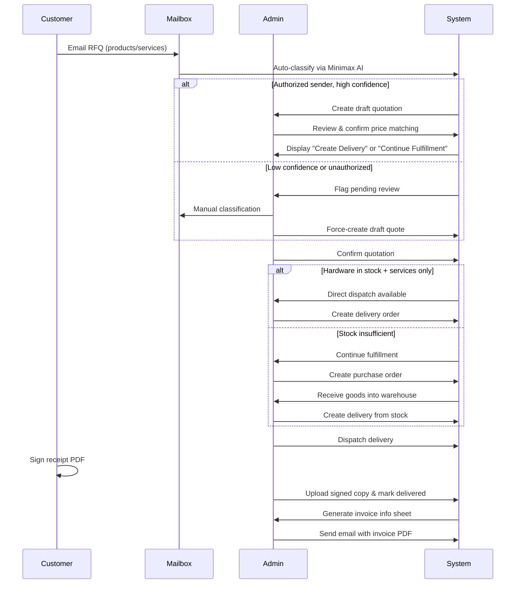

# Workflow Guide - HengJi AMS Operations

This guide provides operational procedures for using the HengJi AMS in daily business operations.

---

## Table of Contents

- [Order Management Workflow](#order-management-workflow)
- [Mailbox & RFQ Processing](#mailbox--rfq-processing)
- [Asset Import Procedures](#asset-import-procedures)
- [Invoice Processing Cycle](#invoice-processing-cycle)
- [Delivery Fulfillment](#delivery-fulfillment)
- [System Administration](#system-administration)

---

## Order Management Workflow

### End-to-End Flow



### Key Roles & Permissions

| Role | Access Level | Typical User Actions |
|------|--------------|---------------------|
| **Order Management Procurement Specialist** | Full access | Create/edit quotations, manage purchases, process deliveries, handle invoices |
| **IT Administrator** | Read-only order management | View quotes/deliveries, no creation permissions |
| **Superadmin** | All system | All actions + user/role management |
| **Viewer** | Asset view only | Cannot access order management |

---

## Mailbox & RFQ Processing

### Automatic RFQ Classification

**Trigger**: Every 5 minutes during `runserver` mode (auto-sync enabled in settings).

**Flow**:
1. IMAP/POP3 mailbox sync fetches new messages
2. Message parsing extracts email body content
3. Minimax API analyzes RFQ items and confidence scoring
4. Draft quotation created if confidence > 80% AND authorized sender
5. Pending task notifications added to dashboard

**Authorization Rules**:
- Only contacts flagged as `is_authorized_rfq_sender=true` qualify for auto-drafting
- Unauthorized senders require manual classification

### Manual Intervention Workflows

#### Reprocessing Messages
1. Navigate to **Accounts → Inbox**
2. Click message to open detail view
3. Select **"Reprocess"** button after corrections
4. Re-run AI classification manually

#### Linking Existing Quotation
1. Open message detail page
2. Click **"Link to Quotation"** dropdown
3. Search/select existing `QT-XXXXXX-XXX`
4. Update status tracking

#### Adding Comments
Use inline comments field on message detail for internal notes that aren't sent to customer.

---

## Asset Import Procedures

### CSV Import Template

1. Navigate to **Companies → Assets → Import**
2. Download sample CSV template
3. Fill data following column format:
   ```csv
   category_name,brand_name,model_name,serial_number,barcode,status,condition,location_name
   Laptop,Dell,XPS 15,SN123456,BC789,Available,New,Vanke VMO Warehouse
   Monitor,HP,Z34c,SN654321,BC012,Assigned,Used,Shanghai Office
   ```

### Validation Rules

| Field | Required | Format Example |
|-------|----------|----------------|
| category_name | ✅ Yes | Exactly matches DB name (case-sensitive) |
| brand_name | ✅ Yes | Must exist in catalog |
| model_name | ✅ Yes | Must match selected brand |
| serial_number | ❌ Optional | Any alphanumeric string |
| barcode | ❌ Optional | Unique per asset |
| status | ✅ Yes | Available/Assigned/Maintenance |
| condition | ✅ Yes | New/Good/Fair/Poor |
| location_name | ✅ Yes | Valid company location |

### Duplicate Handling

**Default behavior**: Skip duplicate serial numbers  
**Action required**: Edit incoming file or update database record first

**Update Mode**: For locations/contacts, checkbox enables "update matched entries instead of skipping"

### Import Result Monitoring

**Post-upload dashboard shows:**
- Total rows processed
- Successfully created count
- Updated vs skipped counts
- Error details (downloadable error report)

**Actions available**:
- ✅ Proceed with import (confirm upload)
- 🔙 Rollback latest import (if eligible)

---

## Invoice Processing Cycle

### Weekly Batch Workflow

**Timeline**: Every Monday, Friday batch imports run automatically

**Steps**:
1. Customer sends Excel invoice list to designated SharePoint folder
2. WeeklyBatch admin downloads and uploads to `/invoices/invoice-info/upload-batch/`
3. System parses XML/PDF/OFD attachments within zip archive
4. Regex extraction pulls:
   - Bill To company name
   - Net amount, tax amount, gross amount
   - Invoice date and number
5. Matched against existing quotations by PO number reference

### Manual Invoice Info Creation

When automated matching fails:

1. Go to **Invoices → Invoice Info → Create**
2. Select source **Quotation** and **Delivery Order**
3. Fill manual fields:
   - Invoice Number (format: `YYMMDD##`)
   - Payment Due Date
   - SAP Cost Center
   - Internal Purchase Order Reference
4. Save and optionally generate PDF document

### Tax Calculation Logic

```python
net_amount = sum(item.net_price for item in line_items)
tax_rate = default_tax_rate_from_customer_profile # Usually 13%
tax_amount = net_amount * tax_rate / (1 + tax_rate)
gross_amount = net_amount + tax_amount
```

Adjust based on actual contract terms.

### Document Generation

Supported formats:
- Excel: Standard invoice information sheet (template-based)
- PDF: Electronic invoice (OFD/PDF/A compliance)
- ZIP bundle: Complete package with all files

Export path: **Invoice Detail → Generate Document → Choose Format**

---

## Delivery Fulfillment

### Dispatch Options

After confirming a quotation:

#### Option A: Direct Dispatch (Stock Ready)
**Conditions**:
- All hardware lines have stock ≥ quantity in quotation
- No pending purchase orders required

**Action**:
1. Click **"Create Delivery"** button on quotation detail page
2. Review pre-filled delivery items
3. Add shipping method selection (送货上门/快递运输/自取)
4. Submit → Delivery created as **Pending**

#### Option B: Continue Fulfillment (Partial Stock)
**Conditions**:
- Some items missing from inventory
- Service-only quotations skip this step entirely

**Action**:
1. Click **"Continue Fulfillment"**
2. System creates Purchase Order for missing quantities
3. Receive goods into warehouse via **Purchases → Stock Receipt**
4. Follow same steps as Option A once stock replenished

### Delivery Status Transitions

```
pending ──→ dispatched ──→ delivered
  ↑              ↓              ↓
│           uploaded      signed_file
│            PDF          required
└─────── confirmation action
```

**Transition actions**:
- `pending → dispatched`: Requires click on "Dispatch Delivery" button
- `dispatched → delivered`: Requires signature upload + form submission

### Signature Requirements

**Before marking delivered**:
- Upload signed copy (PDF preferred, JPG acceptable)
- Add remarks about any discrepancies
- Capture customer name from physical copy if different from template

**Validation**: Signed file URL must not be empty to allow status change.

---

## System Administration

### User Management

#### Creating New Users
1. Navigate to **Accounts → Users → Create**
2. Fill required fields:
   - Username (unique identifier)
   - Email address (for notifications)
   - Password (minimum 8 chars, enforced complexity)
3. Assign roles (additive):
   - Superadmin: Full access
   - IT Administrator: Company/division scoped asset visibility
   - Order Management Procurement Specialist: Quote/delivery/invoice workflows
4. Enable 2FA enforcement (mandatory)
5. Send welcome email with login credentials

#### Role-Based Access Matrix

| Resource | Superadmin | IT Admin | Order Mgmt | Viewer |
|----------|------------|----------|------------|--------|
| Asset CRUD | ✅ | ✅ scoped | ❌ | ✅ read-only |
| Quotation Create | ✅ | ❌ | ✅ | ❌ |
| Purchase Orders | ✅ | ❌ | ✅ | ❌ |
| Deliveries | ✅ | ❌ | ✅ | ❌ |
| Invoice Management | ✅ | ❌ | ✅ | ❌ |
| Product Price List | ✅ | ❌ | ✅ | ❌ |
| User Management | ✅ | ❌ | ❌ | ❌ |
| Company Data | ✅ | ✅ scoped | ✅ scoped | ❌ |

### Configuration Settings

#### Environment Variables
Located in `.env.local` (not tracked in Git):
- Email SMTP credentials
- Minimax AI API keys
- Database connection strings
- WeasyPrint runtime paths

#### Language Preferences
- Login page selector changes language for entire session
- Profile settings also support switching
- Supported: English (`en`), Simplified Chinese (`zh-hans`)

### Maintenance Tasks

#### Daily Checks
- [ ] Review failed mailbox sync logs
- [ ] Verify outbound email queue processing
- [ ] Check disk space utilization (< 80% threshold)

#### Weekly Tasks
- [ ] Run health check: `python manage.py check --deploy`
- [ ] Test critical workflows (quotation → delivery cycle)
- [ ] Rotate temporary passwords for test accounts

#### Monthly Tasks
- [ ] Database backup verification (restore test)
- [ ] Log rotation cleanup
- [ ] Security patch updates via `pip install --upgrade django==5.2.3`

---

## Troubleshooting Common Issues

### RFQ Draft Not Creating Automatically

**Symptoms**: Inbox shows messages but no quotation drafts generated

**Troubleshooting Steps**:
1. Check `accounts.ReceivedEmailMessage.has_pending_rfq=True` for flagged items
2. Verify `MINIMAX_TOKEN_PLAN_KEY` environment variable set
3. Review Minimax API logs for rate limits/errors
4. Test manual reprocessing via message detail page

**Solution**: Manually classify via UI while fixing API key configuration

---

### Delivery Status Stuck at Pending

**Root cause**: Missing stock assignment before dispatch attempt

**Resolution**:
1. Verify `assets.Asset.available_count >= quoted_quantity`
2. Check internal warehouse filtering is active (A-R-Zone logic)
3. Ensure no conflicting reservations from other deliveries

---

### Import Errors After Upload

**Common error patterns**:
- `ValidationError: Invalid category name 'laptop'` → Use exact capitalization
- `Duplicate detected: Serial SN12345 already exists` → Remove duplicate row or edit DB
- `Location 'unknown' not found` → Pre-create location before importing assets

**Best practice**: Preview before confirmation, download errors report

---

## Support Resources

### Documentation Links
- [Architecture Decisions](./ARCHITECTURAL_DECISION_RECORDS.md)
- [API Documentation](./API_GUIDE.md)
- [Deployment Guide](./DEPLOYMENT.md)
- [Contributing Guide](./CONTRIBUTING.md)

### Contact Channels
- 📧 Email: ops@hengji.com
- 💬 Slack Channel: #hengji-support
- 🚨 Emergency Hotline: +86 XXX-XXXX-XXXX

---

*Last Updated: August 20, 2026*
