# Inspections Iteration 2 — Completion Report

| | |
|---|---|
| **Date** | September 24, 2026 |
| **Plan** | `Inspections_Iteration_2_Integration_task-bf4.md` (synthesized from three parallel design passes: simplicity / performance / minimal-risk) |
| **Branch** | `feature/inspections-iteration-2` (based on `origin/main` @ `0b69be7`, the merge of PR #80) |
| **Scope** | Django backend · server-rendered web UI · WeChat mini program · import pipeline · export pipeline |
| **Result** | 27 / 27 plan items delivered, 144 tests green, browser-verified end to end |

---

## 1. Summary

Iteration 2 turns the inspection module from "import a batch and look at a calendar" into the
actual field workflow: import a site list and let the system arrange the schedule, run AM/PM
days on a drag-and-drop board, send a **Field Engineer** out with a mini program that captures
arriving/leaving times, WiFi weak points and device readings automatically, then review the
results in bulk and export the client deliverable (asset list + per-store reports + photos) in
one ZIP.

Headline numbers:

| Metric | Value |
|---|---|
| Plan items delivered | 27 / 27 |
| Tests passing | **144** (+29 new, 1 skipped) |
| Files changed | 48 tracked (+1608 / −469) plus 9 new paths |
| Defects caught during verification | 5 (all fixed, all regression-tested) |
| Browser evidence screenshots | 14 |
| Migrations added | 2 (`inspections/0005`, `accounts/0022`), single linear leaf |

---

## 2. Quality gates (reproduced locally, same commands CI runs)

| Gate | Command | Result |
|---|---|---|
| Lint | `python -m ruff check .` | All checks passed |
| System checks | `python manage.py check` | 0 issues |
| Migration drift | `python manage.py makemigrations --check --dry-run` | No changes detected |
| Tests | `python manage.py test` | Ran 144 tests — OK (1 skipped) |
| Mini program lint | `cd miniprogram && npm run lint` | Clean (eslint) |

The skipped test is the golden-parity case that only runs when a local EUS reference report is
present (it was present and passing during this work — see §10).

---

## 3. Requirement coverage

### R1 — Import asset + site list, auto-arrange the schedule

* `inspections/services/schedule_arranger.py` (new, pure function): `arrange(rows, start, end, slots_per_day=2)`
  clusters sites by **City**, spreads cities across the window, and gives sites that share a
  normalized **Address** consecutive AM/PM slots. Raises `ScheduleCapacityError` when the window
  is too small (surfaced as a form error).
* `inspections/services/kering_import.py`: schedule columns extended with `address`, `city`,
  `phone`; `companies.Location` is populated (`address_line1`, `city`, `phone_number`, and
  `chinese_address` when the address contains CJK) and previously-blank values are refreshed on
  re-import without clobbering operator edits. Missing `inspection_date` no longer skips a row —
  it triggers the arranger. Created inspections carry their `slot`.
* Web: the import form gained **Auto-arrange dates** (on by default) plus **Arrange From / To**.

### R2 — Dashboard: device counts, AM/PM days, drag to rearrange

* `StoreInspection.slot` (`am` / `pm`, default `am`) + index on `(batch, inspection_date, slot)`.
* FullCalendar replaced by a purpose-built **date × (AM | PM)** grid. Each card shows the store
  label, brand, engineer and `collected / total` devices (annotated once in the queryset — the
  previous per-row `COUNT` N+1 is gone).
* HTML5 drag-and-drop posts to `POST /inspections/api/move/` (`{inspection_id, date, slot}`),
  writes inside `transaction.atomic()` and logs a `reschedule` entry in `InspectionSignoffLog`.
* Month navigation (`?month=YYYY-MM`) with prev / next / this-month, batch selector and summary
  tiles retained.

### R3 — Field engineers, inspection detail, mini program

* **Role**: `inspection_engineer` relabelled **Field Engineer** (code unchanged, so no user-role
  data migration; `AdminRole.name` updated by `RunPython`). `User.is_field_engineer()` alias added.
* **User model**: `wechat_id` (indexed), `invite_code` (unique, auto-generated for field
  engineers), `fe_rating` (1–5), `fe_notes`.
* **Matching / onboarding**: engineers can be resolved by Chinese name, phone, WeChat id or
  invite code (`resolve_field_engineers()` shared by the web assign view, the API action and the
  login lookup). Invite-code accounts complete their own contact details once through
  `POST /api/v1/auth/wechat/profile/`, which only fills blank fields so admin-maintained values
  are never overwritten by a client.
* **Automatic times**: `POST /api/v1/inspections/{id}/start/` stamps `arriving_time` (idempotent,
  flips `planned` → `in_progress`); signoff stamps `leaving_time` and generates the per-store
  report server-side. Both remain editable in the backend.
* **WiFi**: `wifi_covers_store` removed (model, serializer, mini program). Replaced by
  `InspectionWifiWeakPoint` rows captured on the mini program's 机柜/网络 page (Good, or N weak
  points each with location + description). `wifi_coverage` is derived: good when there are no
  weak points, otherwise weak. The detail page lists them; the edit page has an inline formset.
* **Devices**: found / not-found reuses `InspectionDevice.Status`; a not-found device **must**
  carry a note, enforced in the write path (not just the serializer). Detail columns (system
  version, IP, CPU, memory, HDD, C-free, comment) show by default and are customizable —
  localStorage on the web detail page, `wx.setStorageSync` on the mini program device list.
  Stats read `inspected / total`.
* **Mini program flow**: 健康检查概要 and the report page removed; 设备数量确认 merged into 签字确认
  (per-category counts, IT rating, auto WiFi good/bad badge, signatures, one POST); 前往同步
  renamed **完成并提交** (flush queue → submit → home); a global `home-button` component is
  available on every page.
* **Issues**: `InspectionIssue.Status` gained `ESCALATED`; status/description are inline-editable
  in the backend.
* **Users app**: "Administrator Management" → **User Management**, filter label "Admin Role" →
  "Role", plus a Field Engineer profile fieldset (Chinese name, phone, WeChat id, invite code,
  service cities, rating, notes).

### R3b — Review page

`/inspections/review/?period=batch|week|month|custom` lists every site in range with expected /
collected / new / not-found / issue counts and a progress bar. Managers can select sites and apply
a bulk status; the action targets each site's **outstanding** expected devices, is scoped to the
inspections the requester may see, and backfills the mandatory note when marking devices not found.

### R4 — Navigation

The `inspections:batch_create` button is gone from the nav dropdown (the route stays live and is
reachable from the Batches page). The dropdown now reads Dashboard · Batches · All Inspections ·
**Review** · **Export**.

### R5 — Export

"Export Asset List" → **Export**. Three include-checkboxes (asset list, photos, per-store reports).
With photos/reports selected the response is a ZIP built by `inspections/services/bundle_export.py`
over a `SpooledTemporaryFile` (spills to disk above 10 MB), mirroring the reference deliverable
layout; reports are regenerated only when stale.

---

## 4. Auto-arrangement: rule and measured result

**Rule (as clarified by the business):** cluster by the `City` column so all sites in one city sit
in consecutive AM/PM slots and cities are spread across the date range (minimizes travel); within a
city, sites sharing the same `Address`/mall (e.g. the three Beijing SKP stores) take consecutive
AM/PM slots, different addresses spread out. Capacity is 1 site per slot, 2 slots per day.

**Measured:** a 7-row schedule with **no** `inspection_date` column was uploaded through the web
form with the window 2026-09-24 → 2026-09-27. Result:

| Site | City | Address cluster | Date | Slot |
|---|---|---|---|---|
| 22001 Beijing SKP Store | Beijing | SKP mall | 2026-09-24 | AM |
| 22002 Beijing SKP Pop | Beijing | SKP mall | 2026-09-24 | PM |
| 22003 Beijing SKP Men | Beijing | SKP mall | 2026-09-25 | AM |
| 22004 Beijing Sanlitun | Beijing | different address | 2026-09-25 | PM |
| 22005 Shanghai Qiantan | Shanghai | Qiantan mall | 2026-09-26 | AM |
| 22006 Shanghai Qiantan Pop | Shanghai | Qiantan mall | 2026-09-26 | PM |
| 38076 Jinan Guihe popup | Jinan | own city block | 2026-09-27 | AM |

Import summary: *"Imported 7 inspections, 0 expected devices, 0 assets across 7 stores."*

---

## 5. Export bundle layout

Verified by listing the produced ZIP server-side:

```text
YSL Sept Verification Batch_Export.zip
├── asset_list.xlsx                                              ← cross-store asset table
├── 38076 YSL Jinan Guihe popup (2026-09-03 PM)/
│   ├── 38076 YSL Jinan Guihe popup Report Per Store.xlsx        ← per-store deliverable
│   └── Photo/overall-1.png
├── 38114 YSL Beijing Sanlitun (2026-09-05 AM)/…
└── 38091 YSL Shanghai Qiantan (2026-09-07 AM)/…
```

The reference layout (`DeviceInspecFeishuAutomation/38076 YSL Jinan Guihe popup/`) uses a plain
`<JDA> <Brand> <Store>` folder. The date + slot suffix is appended **only** when the same store
appears more than once in a bundle, so single-visit exports keep the clean name. Browser download
confirmed: `YSL Sept Verification Batch_Export.zip`, `application/x-zip-compressed`, 2.5 MB.

---

## 6. Data model and migrations

| Migration | Contents |
|---|---|
| `inspections/0005_inspectionwifiweakpoint_and_more` | Add `StoreInspection.slot` + index `(batch, inspection_date, slot)`; remove `wifi_covers_store`; create `InspectionWifiWeakPoint`; extend `InspectionIssue.status` with `escalated` |
| `accounts/0022_user_fe_notes_user_fe_rating_user_invite_code_and_more` | Add `User.wechat_id`, `invite_code`, `fe_rating`, `fe_notes`; `RunPython` renaming the `inspection_engineer` role to "Field Engineer" |

All schema changes are confined to these two migrations, keeping a single linear leaf per app.

---

## 7. Endpoint surface

**Mini program API (`/api/v1/`)**

| Endpoint | Change |
|---|---|
| `POST inspections/{id}/start/` | New — stamps `arriving_time`, idempotent |
| `GET/POST/DELETE inspections/{id}/wifi-weak-points/` | New — replaces the list and re-derives `wifi_coverage` |
| `POST inspections/{id}/assign-fe/` | New — lookup by name/phone/wechat/invite, optional create |
| `POST inspections/{id}/signoff/` | Extended — merged confirmation fields, `leaving_time`, server-side report |
| `POST inspections/{id}/devices/` | Extended — 400 when `not_in_store` without a note |
| `GET inspections/` | Annotated `device_total` / `device_collected` (N+1 removed) |
| `POST auth/wechat/lookup/` | Extended — four identifiers via one resolver |
| `POST auth/wechat/profile/` | New — one-time self-service profile completion (fills blanks only) |

**Web (`/inspections/`)**

| Path | Name |
|---|---|
| `api/move/` | `inspection_move` |
| `review/`, `review/bulk/` | `review`, `review_bulk` |
| `<uuid>/edit/` | `inspection_edit` |
| `<uuid>/assign-fe/` | `assign_fe` |
| `issues/<uuid>/update/` | `issue_update` |
| `export/` | `asset_list_export` |

---

## 8. Defects found during verification (and fixed)

| # | Defect | Root cause | Fix | Regression test |
|---|---|---|---|---|
| 1 | Backend edit page returned HTTP 500 | `inspection_edit.html` reads `inspection`, but `UpdateView` only supplies `object` / `storeinspection` | View also passes `inspection` in the context | `test_edit_page_renders_existing_weak_point`, `test_edit_page_saves_times_and_weak_points`, `test_engineer_cannot_open_edit_page` |
| 2 | WiFi weak points never shown on the detail page | Context supplied them, template never rendered the row | Added a "WiFi Weak Points" row (list, or "None recorded (good coverage)") | `test_detail_page_lists_wifi_weak_points` |
| 3 | Mandatory not-found note was not actually enforced | The device upsert writes model fields directly, bypassing `InspectionDeviceSerializer.validate()` | Same rule enforced in `_upsert_device` via DRF `ValidationError` → 400 | `test_not_in_store_requires_comment` |
| 4 | Review bulk action unreachable, then crashed | Form had no selectable rows; view read `.value` off `Status.choices` tuples | Row checkboxes + action bar; view accepts `inspection_ids`, is scope-checked, backfills the note | `test_bulk_update_status`, `test_bulk_update_by_site_only_touches_outstanding_devices`, `test_engineer_cannot_bulk_update` |
| 5 | Duplicate ZIP entries when a store had AM + PM visits | Bundle folder keyed only on `store_label` | Unique per-visit folder names + canonical report filenames | `test_bundle_folders_are_unique_when_a_store_has_two_slots` |

Additional hardening done in the same pass: field engineers promoted **after** creation now get an
invite code (`set_admin_roles` re-checks); the `wifi-weak-points` endpoint rejects a non-list
payload instead of iterating a string; `app.json` declares `home-button` at the root level (WeChat
global components) rather than inside `window`; the review page's percentage is computed in the
view instead of `` (divide-by-zero).

---

## 9. Deliberate deviations from the plan

| Plan said | Done instead | Why |
|---|---|---|
| Extend `SCHEDULE_COLUMNS` with `device_count` | `address` / `city` / `phone` added; `device_count` dropped | Nothing can persist it: dashboard counts come from real `InspectionDevice` rows, and `device_counts` / `cover_extras` belong to the report contract |
| `pages/device-verify`: customizable detail columns | Customizable detail display implemented on the recorded-device list in `inspection-detail` (persisted with `wx.setStorageSync`) | That list is the mini program's "devices table"; the per-device form already renders every capture field for its category |
| Move endpoint returns 409 on unique conflict | No conflict path; a grid cell holds a list of cards | `StoreInspection` has no unique constraint on `(location, inspection_date)` — two visits per day are legitimate |
| `accounts/views.py` `?role=` filter | Reused the existing `?admin_role=` filter, relabelled "Role" | Same capability, no duplicate query parameter |
| Invite-code profile completion (client only) | Added `POST /api/v1/auth/wechat/profile/` + the client step | Collected details must persist server-side without letting a client overwrite admin-maintained values |

---

## 10. Verification method

1. Throwaway SQLite database (`DATABASE_NAME=verify_db.sqlite3`) migrated from the current models.
2. Seeded with one batch, 6 inspections across AM/PM slots on 3 sites, devices (collected,
   outstanding, not-found with a note), a photo, issues (including one escalated), a WiFi weak
   point, a field engineer with rating/notes/invite code, and one generated report.
3. Driven in a **real browser** as a superuser: dashboard grid, nav, move endpoint, schedule import
   through the web form (real 7-row xlsx upload), review page + bulk action, export download,
   inspection detail, backend edit page, users management.
4. Bundle ZIP contents listed server-side; template/view rendering additionally asserted through
   the Django test client (immune to browser and dev-server caching).
5. Cleanup: throwaway database, seed scripts and temporary xlsx removed; verification server
   processes stopped. The development `db.sqlite3` was never touched.

**Known pitfall recorded while doing this:** on Windows, Django's `allow_reuse_address` lets several
`runserver` instances bind the same port, so a "restarted" server can silently leave the old process
answering — the browser then shows pre-edit templates. Use a fresh port per verification round.

### Golden-parity note

`inspections/tests.py::ReportGoldenParityTests` reconstructs devices from a real EUS report found on
disk and compares cover-page counts. The reference folder now contains
`38076 YSL Jinan Guihe popup`, whose `asset_list` holds a Monitor with Status **"Replaced"** — the
golden `cover_page` counts it, while the ported EUS transform only counts `In Store`. The test's
reconstruction was corrected to treat anything except an explicit `Not In Store` as present, so
parity holds. See §12 for the open question this raises.

---

## 11. Evidence

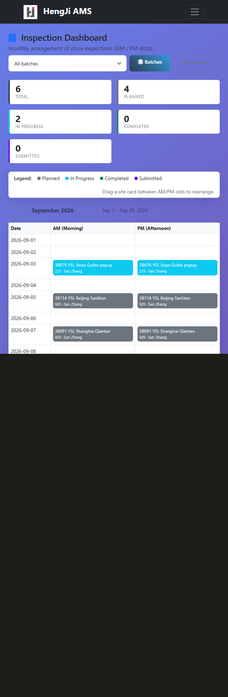

*Dashboard: date × AM/PM grid, `collected/total` per card, summary tiles, month navigation, batch selector.*

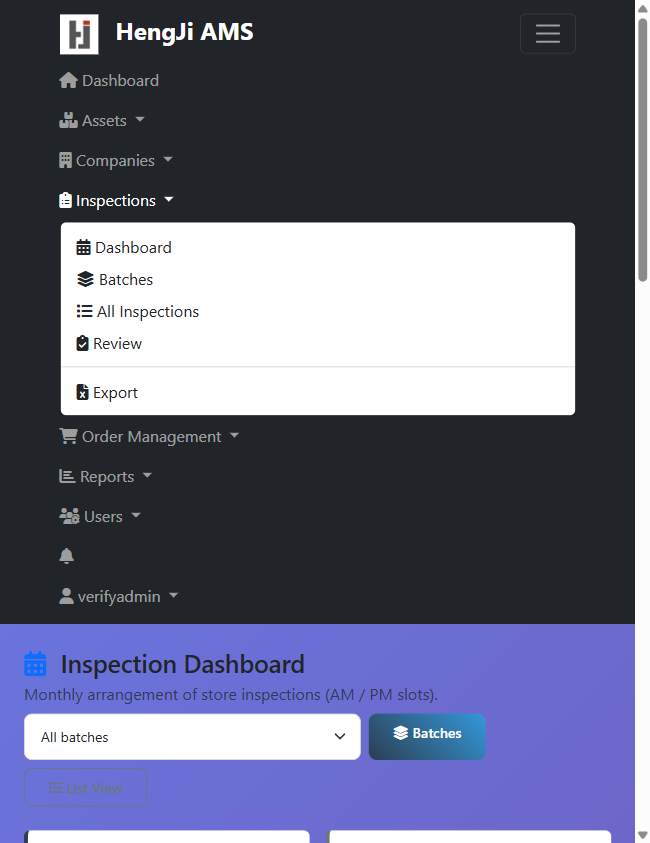

*Nav: Review added, Export renamed, New Batch button removed.*

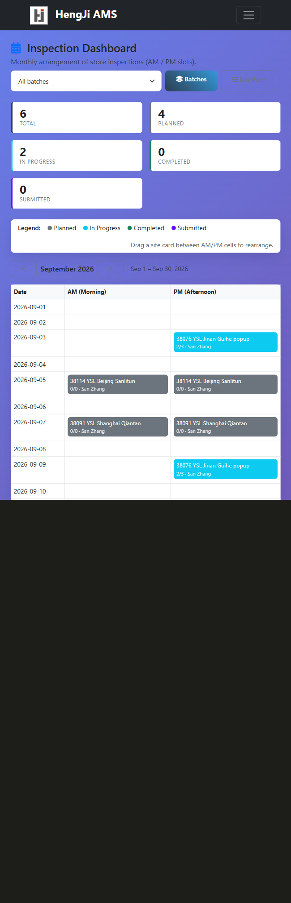

*After the move-endpoint call behind drag-and-drop: the card now sits in the 2026-09-09 PM cell.*

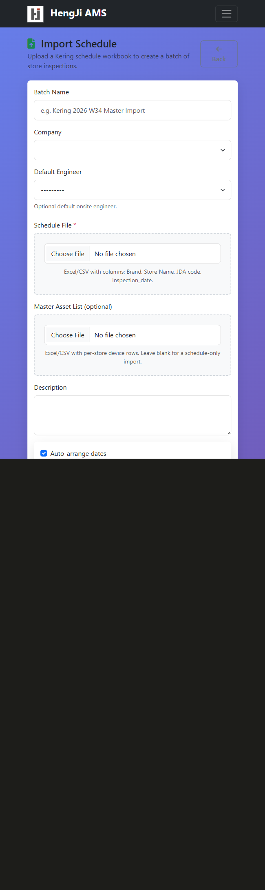

*Import form: Auto-arrange dates (on by default) plus the Arrange From / To window.*

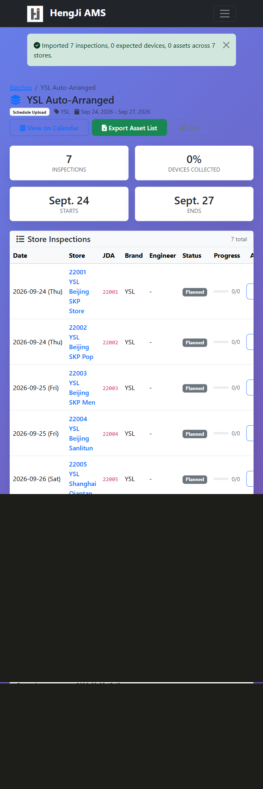

*Result of the real 7-site upload: cities spread across the window, same-mall sites back-to-back.*

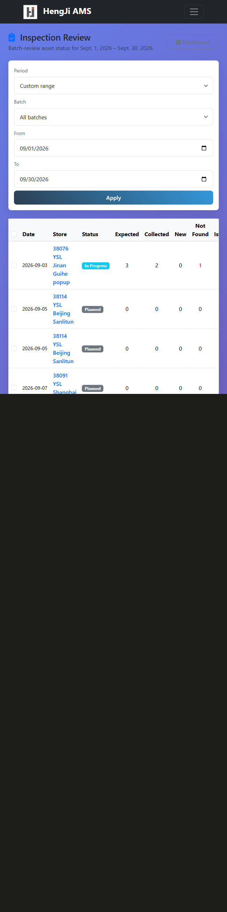

*Review page: expected / collected / new / not-found / issues per site with progress.*

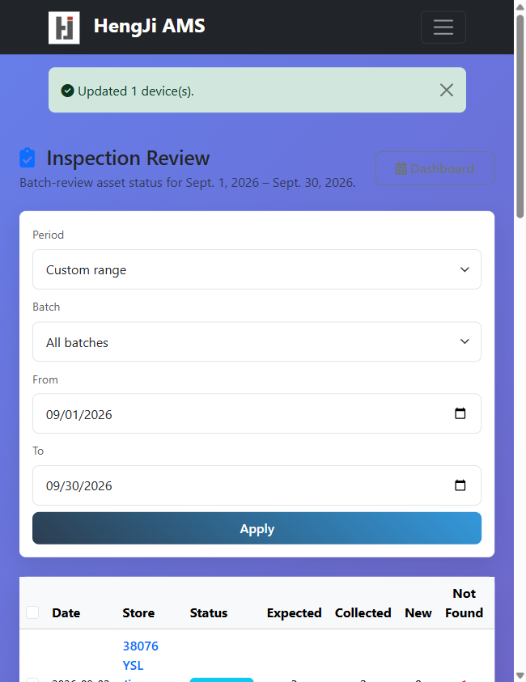

*Bulk action applied: "Updated 1 device(s)" and the Not Found column became 1.*

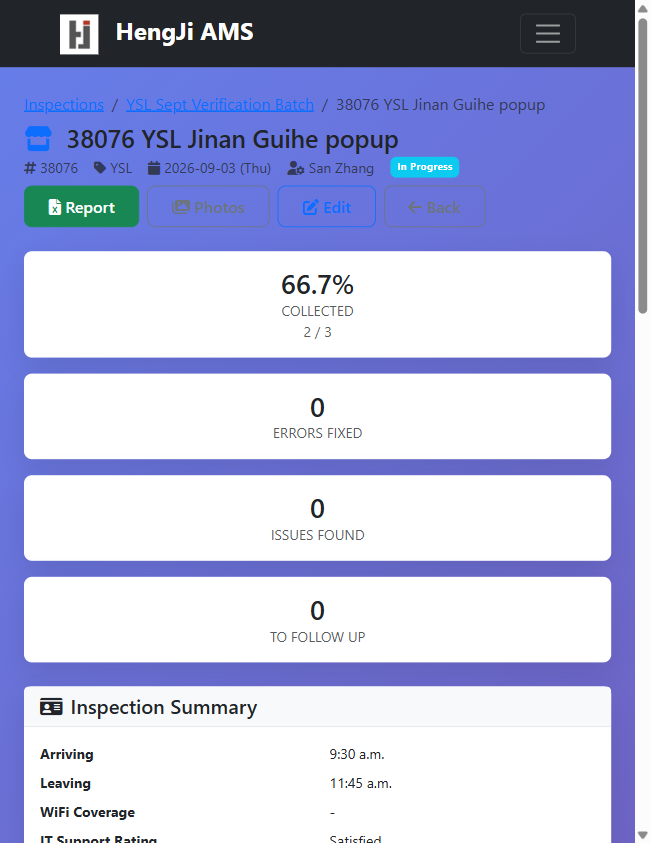

*Inspection detail: "Inspection Summary" (renamed from Cover Page), no WiFi-Covers-Store row, FE rating 5/5 + notes.*

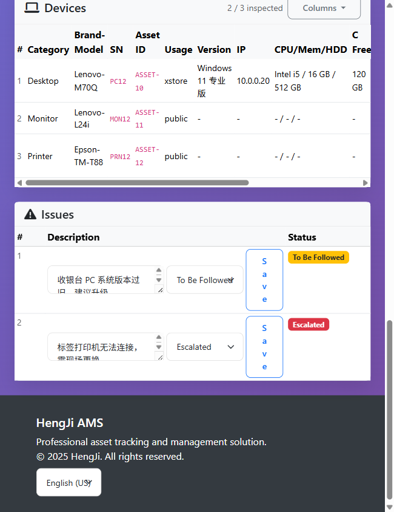

*Devices: `2 / 3 inspected`, detail columns on by default with a Columns chooser, escalated issue inline-editable.*

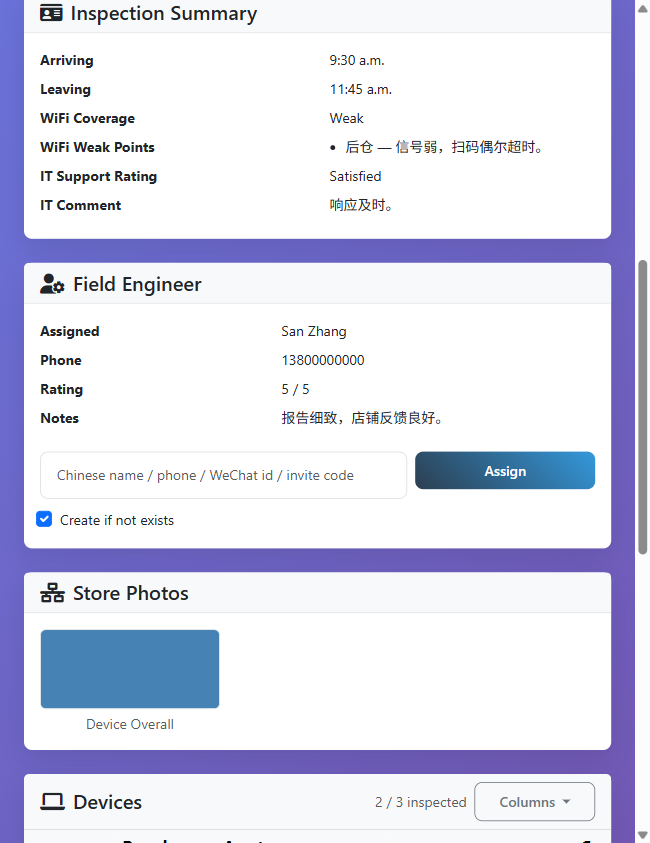

*WiFi Coverage "Weak" with the recorded weak point (后仓 — 信号弱，扫码偶尔超时。).*

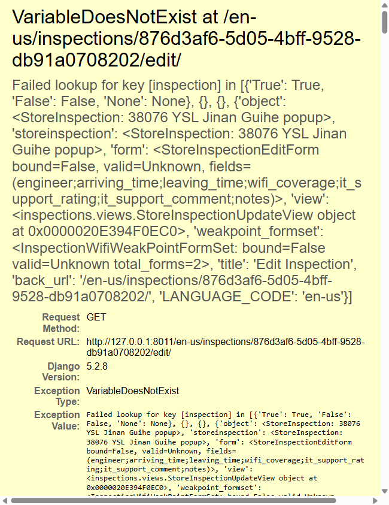

*Defect #1 caught in the browser: template `VariableDoesNotExist` on the edit page.*

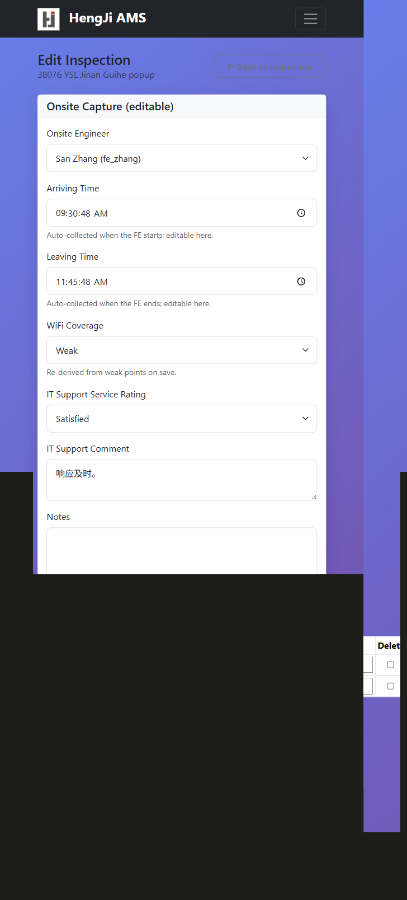

*After the fix: onsite-capture fields plus the WiFi weak-point formset.*

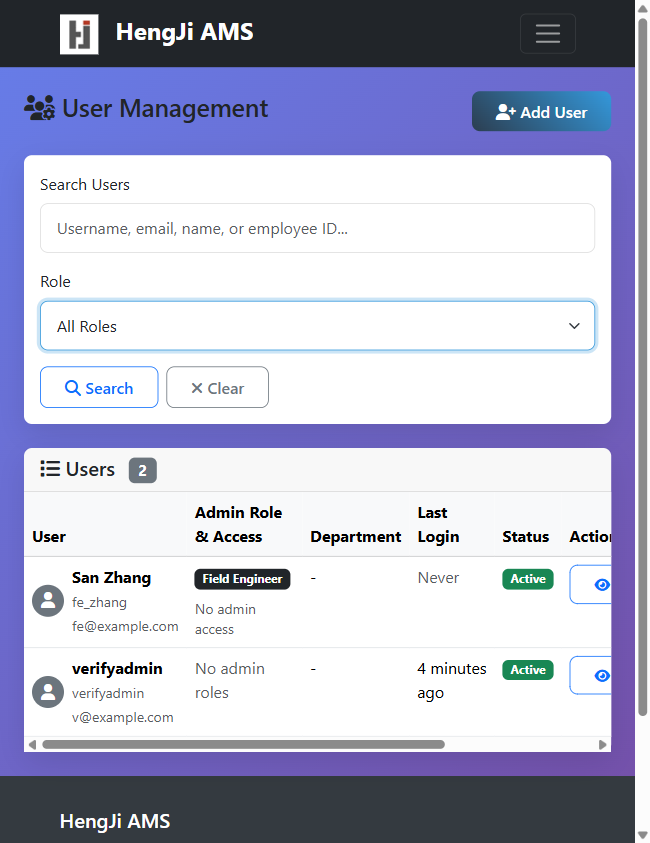

*User Management (renamed from Administrator Management) with the Field Engineer role filter.*

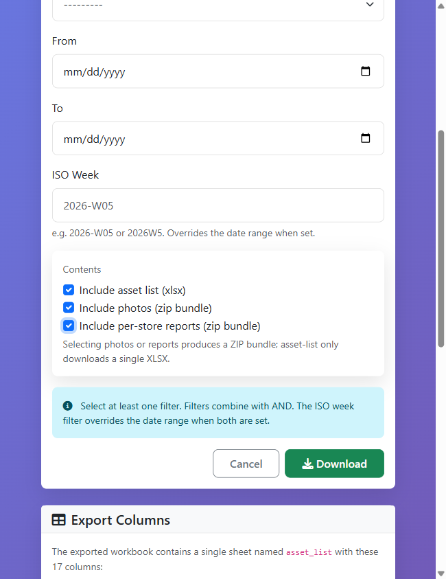

*Export page with the three include-checkboxes.*

---

## 12. Open question for the business

`Replaced` is not a status in our model (`InspectionDevice.Status` is `in_store` / `not_in_store`),
yet the EUS reference report uses it for a device that was present on site but swapped during the
visit — and counts it on the cover page. Adding it would change report output, so it needs a
decision rather than an assumption.

---

## 13. Follow-ups (not in this iteration)

* Persist the schedule's declared `device_count` per site (needs a new field) so a schedule-only
  import can show `0 / 73` before the asset list arrives.
* Consider a `Replaced` device status once the business rules are confirmed.
* Mini program: the merged signoff and WiFi weak-point flows are implemented and lint-clean but
  have not been exercised in WeChat DevTools against a deployed backend.
* Verification screenshots for this iteration live in this folder; the earlier iteration's set is in
  `docs/verification/inspections-frontend/` (PR #81).

---

*Author: Sean Liu (with Qoder) · Generated September 24, 2026*
